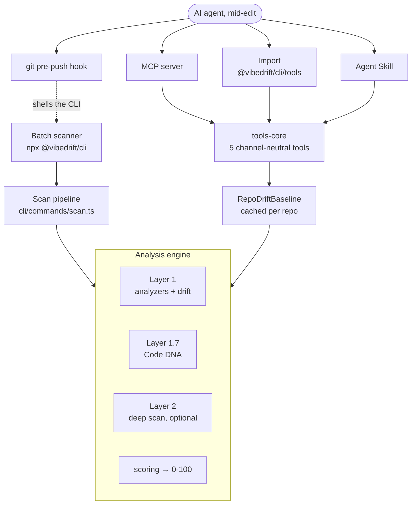
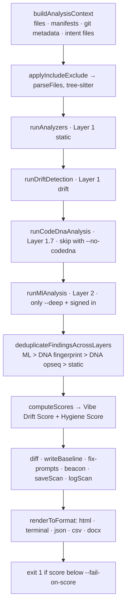
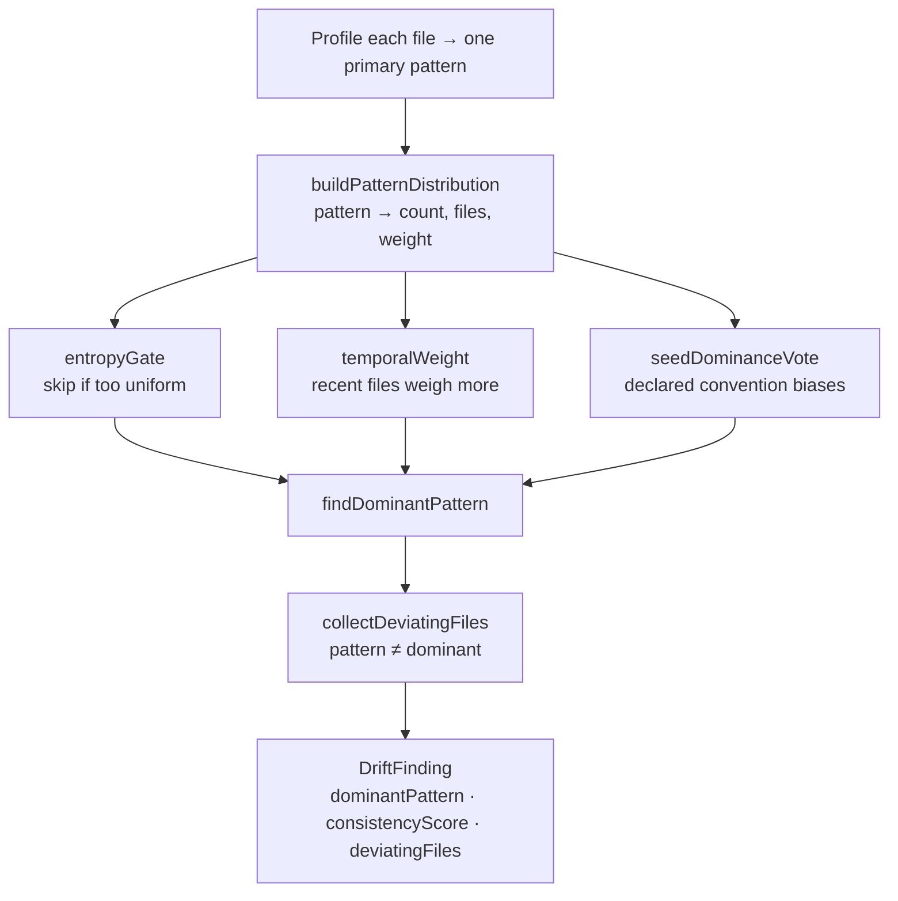
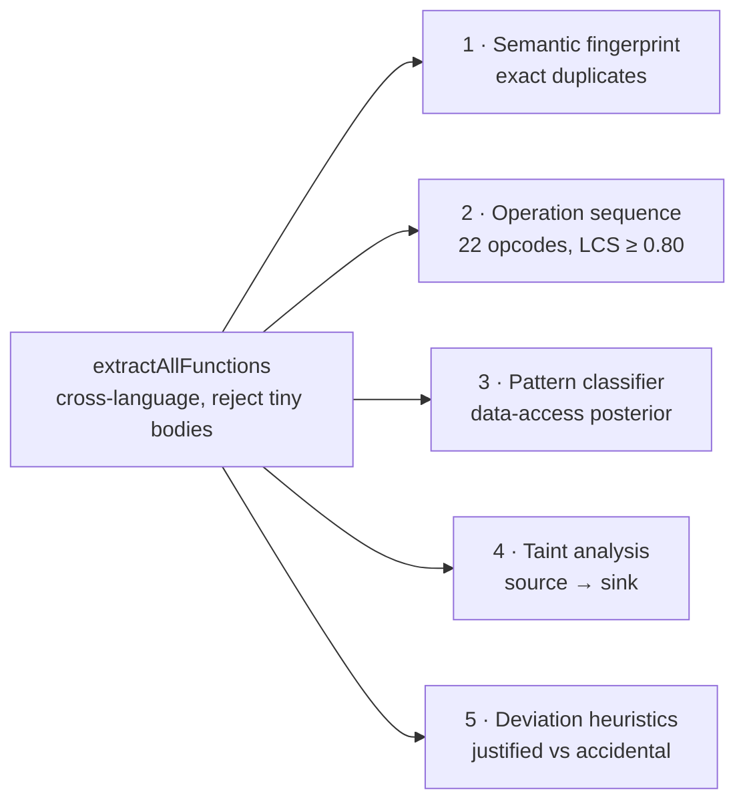
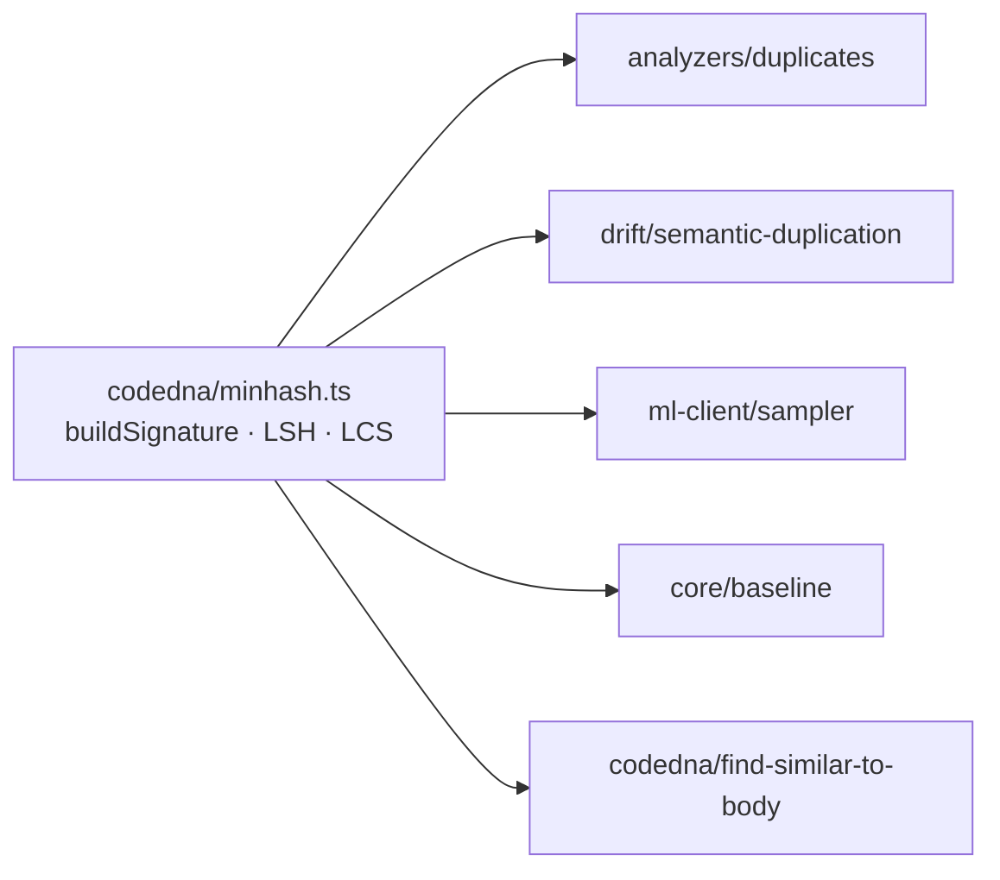
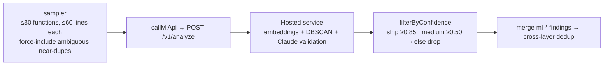
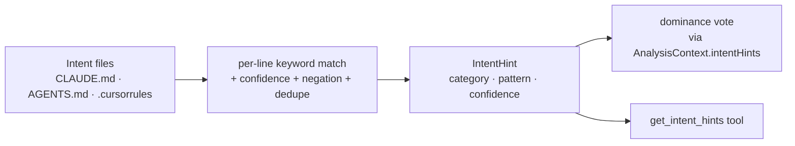
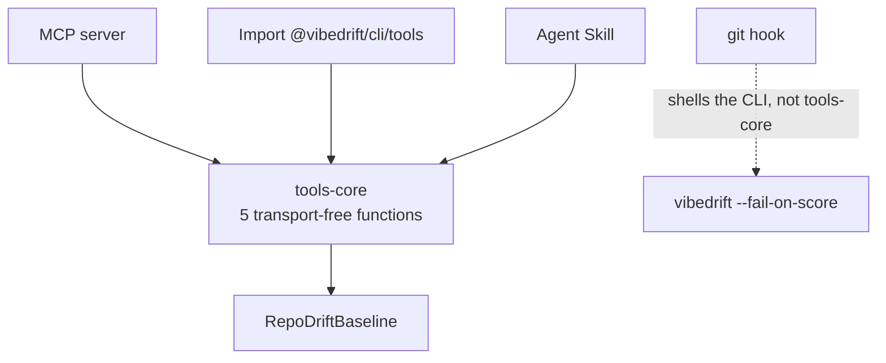
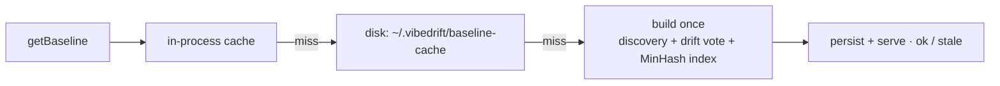
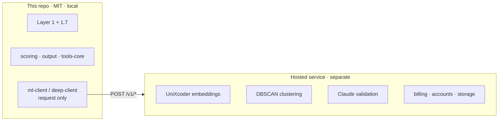

# VibeDrift Architecture

> How the open-source `@vibedrift/cli` fits together: the layered engine, the scan pipeline, the
> scoring math, and the channel-portable in-loop tools. This is the map. Companion docs are the
> territory: [`docs/algorithms.md`](./docs/algorithms.md) (per-heuristic audit),
> [`docs/tools-api.md`](./docs/tools-api.md) (tools API), and [`AGENTS.md`](./AGENTS.md) /
> [`CONTRIBUTING.md`](./CONTRIBUTING.md) (conventions).

> **Diagrams render natively on GitHub (Mermaid).** No plugin needed; if you read this in a viewer
> without Mermaid support, the diagrams show as fenced code.

## Contents

- [1. What it is](#1-what-it-is)
- [2. Principles](#2-principles)
- [3. The two faces](#3-the-two-faces)
- [4. The layered engine](#4-the-layered-engine)
- [5. Core data types](#5-core-data-types)
- [6. The scan pipeline](#6-the-scan-pipeline)
- [7. Static analyzers](#7-static-analyzers)
- [8. Drift detectors and the dominance vote](#8-drift-detectors-and-the-dominance-vote)
- [9. Code DNA](#9-code-dna)
- [10. Deep scan (Layer 2)](#10-deep-scan-layer-2)
- [11. Scoring](#11-scoring)
- [12. Intent hints](#12-intent-hints)
- [13. In-loop tools and channels](#13-in-loop-tools-and-channels)
- [14. Output](#14-output)
- [15. Persistence and determinism](#15-persistence-and-determinism)
- [16. Auth and telemetry](#16-auth-and-telemetry)
- [17. The open-core boundary](#17-the-open-core-boundary)
- [18. Build and packaging](#18-build-and-packaging)
- [19. Extending](#19-extending)
- [20. Constants reference](#20-constants-reference)
- [21. Sharp edges](#21-sharp-edges)

---

## 1. What it is

VibeDrift's product is drift *prevention*: an AI agent consults the repo's own conventions in the
loop and self-checks new code before it lands. The batch scanner and the engine below are the proof
underneath that promise. The same dominance-vote engine that scores a whole repo answers an agent's
mid-edit questions.

It measures **drift** (how consistent code is with its own dominant patterns), reported as the
**Vibe Drift Score**. That is deliberately not a quality or tech-debt score. Two shapes, one engine:

- **Batch scanner** (`npx @vibedrift/cli`): scans a repo, emits a 0-100 score with file-level evidence.
- **In-loop tools**: five checks an agent calls while writing, over four channels (MCP, import, Agent Skill, git hook).

TypeScript/ESM, runs fully local; talks to a hosted service only for the optional metered deep scan.

---

## 2. Principles

| Principle | What it means in code |
|-----------|----------------------|
| **Drift, not quality** | Every detector needs a peer-group baseline to deviate from. No baseline, no finding. |
| **Determinism** | Same commit, same score, anywhere. Code-unit sort, order-preserving runs, `en-US` numbers, no randomness. |
| **Local-first / open-core** | Layers 1 and 1.7 ship here and run locally. Layer 2 is a thin client; embeddings/LLM run server-side. |
| **Fail-soft** | Network features degrade, never throw. Tools return a `status`; missing git silently drops temporal signals. |
| **Channel portability** | The five tools live in a transport-free core; MCP / import / skill are thin adapters. |
| **Honest telemetry** | A default scan sends one anonymous beacon + a daily update check, both opt-out. `--local-only` makes a run fully offline. |

---

## 3. The two faces

The batch scanner runs the full engine; the in-loop tools run a slice of it against a cached
baseline (built once per repo). The git hook is the exception: it shells back to the CLI.



---

## 4. The layered engine

| Layer | Where | Adds | Cost |
|-------|-------|------|------|
| **1 · static** | `src/analyzers/` (13) | Single-file checks: naming, imports, complexity, security, dead code, deps | local |
| **1 · drift** | `src/drift/` (14) | Cross-file dominance voting: "8 of 10 do X, the 2 are drift" | local |
| **1.7 · Code DNA** | `src/codedna/` (5) | Fingerprints, MinHash near-dupes, op-sequences, taint, deviation | local |
| **2 · deep scan** | `src/ml-client/` + `mcp/deep-client.ts` | UniXcoder embeddings, clustering, LLM-validated dupes/intent | cloud, metered |

Supporting: `scoring/` (0-100), `output/` (reports), `tools-core/` (in-loop tools), `mcp/` (adapter),
`intent/` (declared conventions), `auth/` + `telemetry/`, `core/` (the spine). Languages:
**JS, TS, Python, Go, Rust** via `web-tree-sitter`.

---

## 5. Core data types

Five types in `src/core/types.ts` carry almost everything.

| Type | Role |
|------|------|
| `SourceFile` | Unit of analysis: path, language, content, lazy tree-sitter `tree`, grafted git metadata. |
| `AnalysisContext` | Read-only bundle handed to every analyzer: files, manifests, `totalLines`, languages, `intentHints`. |
| `Finding` | Universal output: `analyzerId` (routing key), severity, confidence, locations, `consistencyImpact?`, `metadata?`. |
| `DriftFinding` | A detector's rich record: dominant pattern, counts, `consistencyScore`, deviating files + evidence. |
| `ScanResult` | The full object every renderer consumes: findings, both score tracks, per-file scores, diff, Code DNA. |

---

## 6. The scan pipeline

`runScan` (`src/cli/commands/scan.ts`) orchestrates a fixed, load-bearing order.



Flag effects: `--deep` adds Layer 2 (forced off under `--local-only`); `--local-only` skips all
network; `--json` overrides `--format`; `html` serves on a local port for 10 min instead of exiting;
`--write-context` and `watch` require sign-in.

---

## 7. Static analyzers

Thirteen analyzers, each an `Analyzer` object; `createAnalyzerRegistry()` returns them in a fixed
order and findings are reassembled in that order for determinism.

| Analyzer | Category | Kind | Detects |
|----------|----------|------|---------|
| `naming` | architectural | **drift** | Naming-convention split (entropy-gated) |
| `imports` | architectural | **drift** | Mixed ESM / non-builtin CommonJS |
| `error-handling` | architectural | hygiene | Empty catches, unhandled async |
| `language-specific` | architectural | hygiene | Go/Python/Rust idiom violations |
| `duplicates` | redundancy | hygiene | Cross-file near-dupes (MinHash + LCS) |
| `todo-density` | redundancy | hygiene | TODO outliers, stub-adjacent TODOs |
| `dead-code` | redundancy | hygiene | Dead exports, orphan files, unreachable code |
| `dependencies` | dependencyHealth | hygiene | Phantom / missing deps |
| `config-drift` | dependencyHealth | hygiene | Undocumented vs unused env vars |
| `security` | securityPosture | hygiene | ~24 OWASP-style rules, Bayesian-stacked |
| `intent-clarity` | intentClarity | hygiene | Generic names, long functions, low docs |
| `complexity` | intentClarity | hygiene | Cognitive complexity, p90/median |
| `implementation-gap` | intentClarity | hygiene | Placeholder returns, `panic`, `todo!()` |

**The key fact:** `category` picks a scoring bucket; a separate `kind` decides drift vs hygiene.
Only `naming` and `imports` are drift-kind; the other 11 feed the Hygiene Score, not the headline.
That is the drift-not-quality principle in code. `version` is the per-analyzer cache-invalidation knob.

---

## 8. Drift detectors and the dominance vote

The heart of the product. Each detector reduces every file to one pattern, votes within a peer
group, and flags deviators.



Key gates: min peer group 3, dominance share 0.7, entropy "no convention" above 0.8, temporal
half-life 90 days (`2·exp(-ln2·days/90)`), intent boost 1.5x. `seedDominanceVote` computes the raw
dominant first, so a declaration that flips a close vote still reports the divergence honestly.

| Detector | Drift category | Weight\* |
|----------|----------------|:------:|
| `architectural-contradiction` | architectural_consistency | 16 |
| `security-consistency` | security_posture | 14 |
| `semantic-duplication` | semantic_duplication | 14 |
| `convention-oscillation` | naming_conventions | 12 |
| `phantom-scaffolding` | phantom_scaffolding | 12 |
| `import-consistency` | import_style | 12 |
| `return-shape-consistency` | return_shape_consistency | 12 |
| `async-consistency` | async_patterns | 10 |
| `export-consistency` | export_style | 10 |
| `state-management-consistency` | state_management_consistency | 10 |
| `logging-consistency` | logging_consistency | 8 |
| `test-structure-consistency` | test_structure_consistency | 6 |
| `comment-style-consistency` | comment_style_consistency | 5 |
| `commit-archaeology` | architectural_consistency (folds in) | - |

\*`DRIFT_WEIGHTS` are report-bar weights only, not the composite (Section 11). 14 detectors map to 13
categories because `commit-archaeology` reuses one. `async-style.ts` (shared classifier) and
`pivot-detector.ts` (post-pass) are not registered detectors.

Two post-passes enrich findings: **pivot detection** reclassifies a mid-migration directory's old
files as `legacy` (migrate later) rather than `drift` (fix now); **intent divergence** stamps a
finding with the declared rule it contradicts. Invariant: `driftFindingToFinding` keys `analyzerId`
off the typed `driftCategory` (`drift-<category>`), so a new detector must set its category to count.

---

## 9. Code DNA

Local, network-free semantic analysis. `runCodeDnaAnalysis` extracts functions once, then runs five
modules.



The exact-duplicate path uses a two-pass FNV-1a + SHA-256 fingerprint. The **MinHash/LSH/LCS**
machinery in `minhash.ts` is a shared primitive the orchestrator does *not* call directly. Five other
subsystems do:



Config (128 hashes, k=5 shingles, 16x8 bands) is audited in `docs/algorithms.md`.

---

## 10. Deep scan (Layer 2)

The only part that sends anything off the machine, and only function snippets, never whole files.
Opt-in, signed-in, fail-soft.



The CLI sends `llm_validations: []` and lets the server validate borderline cases, so no LLM runs in
this repo. `ml-client` also drives the dashboard side-channels (`/v1/summarize`, `/v1/fix-prompts`,
`/v1/scans/log`), all Bearer-authed and silent on failure. `sanitize-result.ts` strips paths and raw
content before any upload.

---

## 11. Scoring

`src/scoring/engine.ts` runs **two parallel tracks** over the same findings, split by `kind`: the
**Vibe Drift Score** (drift-kind only, the headline) and the **Hygiene Score** (hygiene-kind). They
never mix. Five categories, 20 points each, exponential decay:

```
score = maxScore · e^(-K_DECAY · adjustedWeight)        K_DECAY = ln(2) / 15

weight = severity (error 3, warning 1.5, info 0.5)
       · confidence · fileImportance (1.5x entry points)
       · correlationAmplifier (1.5x if ≥4 analyzers hit a file, 1.3x if ≥3)
perAnalyzerCap = maxScore · 0.6        sizeFactor = sqrt(totalLines/1000), clamp [0.5, 4.5]
adjustedWeight = cappedWeight / sizeFactor
```

- **Drag penalty** (drift track): `architecturalConsistency` or `redundancy` below 50% subtracts up
  to 10% of the composite each. A repo cannot hide weak architecture behind perfect security.
- **Normalization**: `dependencyHealth` has no drift-kind analyzers, so it drops out. The drift
  composite is usually 4 categories (max 80) normalized to `/100`; hygiene uses all 5 (max 100).
- **Cross-layer dedup** keeps one duplicate finding per file set (`ml-duplicate` > `codedna-fingerprint`
  > `codedna-opseq` > `duplicates`) and annotates "confirmed by ...".
- **Version stability**: `SCORING_VERSION` (`"v3"`) gates cross-version deltas silently, with a
  one-time "scoring refined" notice. Trend lines stay comparable across releases.

---

## 12. Intent hints

`src/intent/parser.ts` turns declared conventions into a force that biases the vote: a stated rule
outweighs a close raw vote, and a violation becomes a high-confidence finding.



Hints at confidence ≥ 0.6 seed the vote: present patterns get a 1.5x boost, absent ones a virtual
vote worth ~2 files. Hard contract: a hint's `pattern` string must match the detector's emitted
pattern exactly, or it parses but never binds.

---

## 13. In-loop tools and channels

Five tools in `src/tools-core/`, transport-free, returning plain data with a `status` (never
throwing).

| Tool | Args | Returns |
|------|------|---------|
| `getIntentHints` | `{ rootDir }` | declared conventions |
| `getDominantPattern` | `{ rootDir, dimension }` | the repo's majority pattern + examples |
| `checkFileDrift` | `{ rootDir, filePath }` | whether a file fits, with deviations |
| `findSimilarFunction` | `{ rootDir, body, deep? }` | existing functions that already do this |
| `validateChange` | `{ rootDir, targetPath, body, deep? }` | would this drift or duplicate |

`status` is one of `ok`, `partial`, `stale`, `no_baseline`, `degraded`. `deep: true` runs the metered
Layer-2 check on the one function and degrades gracefully offline.



The baseline is built lazily and cached, so tools answer in milliseconds:



Architectural quirk: `baseline-provider.ts` and `deep-client.ts` live under `src/mcp/` but are
imported *by* `tools-core`, so `src/mcp/` is not redundant. A `nudge` (deep-scan offer) is attached to
write-time tools, gated to be rare (signed in, ≥8 calls, 1-day cooldown, deep scan older than 3 days).

---

## 14. Output

`src/output/` is a pure presentation layer over a `ScanResult`; `src/render.ts` is the `"./render"`
export.

| Renderer | Output |
|----------|--------|
| `terminal.ts` | Colorized report (full / brief), JSON dump |
| `html.ts` | Interactive report, `summary` + `detailed` (radar, coherence matrix, evidence, file ranking) |
| `csv.ts` / `docx.ts` | Multi-section CSV; hand-rolled OOXML `.docx` |
| `history-diff.ts` | Scan-over-scan resolved / new / persistent + score deltas |
| `fix-prompt.ts` | Markdown AI-paste prompts (per finding + full plan) |
| `context-md.ts` | Committable `.vibedrift/` files for agents (`--write-context`) |
| `tease.ts` | Deep-scan upsell naming specific files |

The generated HTML report makes two browser calls (a report-open beacon when a `scanId` is present,
and a vote pixel), which is why the docs never claim a default report sends nothing.

---

## 15. Persistence and determinism

Everything persists under `~/.vibedrift/`, never in the project tree; per-project dirs are
`sha256(rootDir)[:16]` so listings leak no paths.

```
~/.vibedrift/
  config.json              auth token + flags (mode 0600)
  scans/<hash>/            history (keep 10) + finding digests
  baseline-cache/<hash>    in-loop tools' baseline
  git-metadata-cache/<hash> per-HEAD git aggregation
  findings-cache/<hash>/   per-analyzer cache (30d TTL, 500MB cap)
  version-check.json       24h update-check cache
```

Cache-invalidation knobs: `analyzer.version`, `BASELINE_VERSION`, `HISTORY_SCHEMA_VERSION`;
`SCORING_VERSION` gates score deltas. Determinism is enforced by code-unit sorting, order-preserving
runs, ±3-line finding digests, and `en-US` number formatting.

---

## 16. Auth and telemetry

Device-auth flow (`src/auth/`): `vibedrift login` opens the browser and polls the token endpoint;
the token lands in `~/.vibedrift/config.json` (mode 0600). Resolution precedence: flag, then
`VIBEDRIFT_TOKEN`, then config. API base defaults to `https://vibedrift-api.fly.dev`.

The beacon (`src/telemetry/`) sends exactly `{ language, file_count, loc, scan_time_ms, cli_version,
is_deep, has_git, has_intent_hints, finding_count, score, authed }`: no code, paths, or identifiers.
Three opt-outs: `--local-only` (gates all network), `VIBEDRIFT_TELEMETRY_DISABLED` (any value),
`vibedrift telemetry disable`. On by default for everyone, disclosed plainly in the README.

---

## 17. The open-core boundary

This repo is the **open client**. The hosted service is separate: no embedding, clustering, or model
inference code lives in `src/`.



| Endpoint | Purpose |
|----------|---------|
| `POST /v1/analyze` | Deep-scan findings (`--deep`, in-loop `deep: true`) |
| `POST /v1/summarize` | Claude executive summary |
| `POST /v1/fix-prompts` | Peer-grounded fix prose |
| `POST /v1/scans/log` | Sanitized result for the dashboard |
| `POST /v1/beacon/*`, `/v1/vote` | Anonymous telemetry + report votes |
| `/auth/*`, `/account/*` | Device auth, usage, billing portal |

Server-side constants (UniXcoder, DBSCAN `eps=0.30`, cosine thresholds) are documented in
`docs/algorithms.md` for completeness. `@anthropic-ai/sdk` is a dev-only dep (eval harness), never
bundled.

---

## 18. Build and packaging

`tsup` bundles four entry points to ESM:

| Entry | Output | Public as |
|-------|--------|-----------|
| `src/cli/index.ts` | `dist/cli/index.js` | `.` (the CLI) |
| `src/render.ts` | `dist/render.js` | `./render` |
| `src/tools-core/index.ts` | `dist/tools-core/index.js` | `./tools` |
| `src/mcp/server.ts` | `dist/mcp/server.js` | (via `vibedrift mcp`, not exported) |

The tarball ships only `dist/`, `bin/`, `skills/`. `prepublishOnly` runs lint + typecheck + test +
build; CI also runs gitleaks. Node 20+ required. The `eval/` harness is a manual, metered A/B (not in
CI).

---

## 19. Extending

| To add | Steps |
|--------|-------|
| **Static analyzer** | Implement `Analyzer`, register in `analyzers/index.ts`, map `id` + `kind` in `scoring/categories.ts`. Unregistered ids default to hygiene. |
| **Drift detector** | Add to `src/drift/`, add `DriftCategory` + `DRIFT_WEIGHTS` in `types.ts`, register in `createDriftDetectors()`. Must use a dominance/similarity signal. |
| **In-loop tool** | Add `tools-core/tools/<name>.ts` (`run` + zod schema), re-export, add a thin `mcp/tools/` adapter. Serves every channel. |
| **Channel** | Import `@vibedrift/cli/tools`, call the functions, call `finalizeResult` on write-time tools. |
| **Language** | Extend `SupportedLanguage`, `EXTENSION_MAP`, the grammar in `utils/ast.ts`, and per-language patterns. |
| **Scoring tweak** | Edit `engine.ts` constants, then bump `SCORING_VERSION`. |
| **Scoring heuristic** | Add a `docs/algorithms.md` section (What / Why / Limitations / Tests). |

---

## 20. Constants reference

`docs/algorithms.md` is the canonical audit for similarity and vote constants.

| Area | Constants |
|------|-----------|
| **Scoring** | `K_DECAY = ln2/15`; severity 3 / 1.5 / 0.5; entry-point 1.5x; correlation 1.5x (≥4) / 1.3x (≥3); per-analyzer cap 0.6x; sizeFactor `sqrt(lines/1000)` clamp [0.5, 4.5]; drag 10% per category below 50%; per-file decay `ln2/5`; `SCORING_VERSION="v3"` |
| **Drift vote** | min group 3; dominance 0.7; entropy gate 0.8; temporal `2·exp(-ln2·d/90)` (90d half-life); intent boost 1.5x; pivot 90d / 70 / 60 |
| **Code DNA** | MinHash 128 hashes; shingle k=5; LSH 16x8; op-sequence ≥0.80 (22 opcodes); semantic-dup LCS ≥0.7; tool find-similar 0.6 / 0.8 |
| **Deep scan** | ≤30 functions / ≤60 lines; ship ≥0.85, medium ≥0.50; UniXcoder 768-dim; DBSCAN eps 0.30, min_samples 2 |
| **Discovery / history** | max 5000 files / 1MB; finding digest `floor(line/3)`; history keep 10; hook threshold 70; grades A90/B75/C50/D25; API `vibedrift-api.fly.dev` |

---

## 21. Sharp edges

Non-obvious invariants worth internalizing before you change the engine.

- **Only `naming` and `imports` are drift-kind among the statics.** The other 11 feed the Hygiene
  Score, not the headline Vibe Drift Score.
- **A finding routes by `analyzerId`.** For detectors that is `drift-<driftCategory>` (the typed
  category). An unregistered id silently defaults to hygiene.
- **`computeScores` mutates findings** (`consistencyImpact`) on the drift track only.
- **`dependencyHealth` has no drift signal**, so it drops from the drift composite (max 80 → 100).
- **The MinHash engine is not called by the Code DNA orchestrator**; it is a shared primitive used by
  five other subsystems.
- **`src/mcp/` is not redundant with `tools-core`**: `baseline-provider` and `deep-client` live under
  `mcp/` but are imported by `tools-core`.
- **The git hook shells the CLI**, so it needs `vibedrift` on PATH and gates on the aggregate score.
- **A default scan and report make network calls** (beacon, update check, report-open, vote pixel).
  `--local-only` is the fully offline path.
- **The registries are the source of truth for counts**: `analyzers/index.ts` and `drift/index.ts`
  define 13 analyzers, 14 detectors across 13 categories, 24 security rules.
