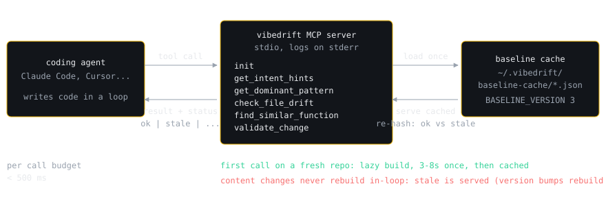

<div align="center">


# vibedrift

### Your AI drives. VibeDrift navigates.

[](https://vibedrift.ai)
[](https://www.npmjs.com/package/@vibedrift/cli)
[](./LICENSE)
[](https://discord.gg/YVcQ65Jt3Q)

**Open source · Analysis runs on your machine · JS/TS, plus Python, Go and Rust**

```bash
npx @vibedrift/cli
```

</div>

---

## Contents

- [What drift is](#what-drift-is)
- [The three channels](#the-three-channels)
- [The CLI: you run it](#the-cli-you-run-it)
- [The MCP server: your agent asks](#the-mcp-server-your-agent-asks)
- [Drift Sessions](#drift-sessions-preview)
- [What it detects](#what-it-detects)
- [Scanning and reports](#scanning-and-reports)
- [Configuration](#configuration)
- [Deep scan](#deep-scan)
- [CI integration](#ci-integration)
- [Privacy](#privacy)
- [Command reference](#command-reference)
- [Pricing](#pricing)
- [Developer Handbook](#developer-handbook)
- [Contributing](#contributing)
- [License](#license)
- [Links](#links)

## What drift is

Every fresh agent session starts with no memory of the conventions your codebase already settled on. So it makes reasonable choices that are not *your* choices.

One handler throws a typed error, the next returns a plain object. Eight services go through a repository layer, the ninth reaches for raw SQL. Everything compiles, everything passes review, and the codebase slowly stops agreeing with itself.

That gap is **drift**. Linters miss it by design: a linter checks one file against a rulebook. VibeDrift checks your codebase against *itself*. It learns the patterns your code already agrees on, flags the files that deviate, and points at the exact line.

## The three channels

VibeDrift reaches your code three ways. One local engine, three different moments.

| Channel | Who starts it | What you get | Tier |
| --- | --- | --- | --- |
| **[CLI](#the-cli-you-run-it)**<br>`vibedrift` | **You**, after the code exists | Scans, HTML reports, a CI gate, continuous watch, a git pre-push gate | Free (`watch`, the pre-push gate and deep scan are Pro) |
| **[MCP server](#the-mcp-server-your-agent-asks)**<br>`vibedrift mcp` | **Your agent**, before it writes | Seven tools it can call: the repo's dominant pattern, near duplicates, whether a file drifts | Free (an opt-in `deep` flag on two tools is metered) |
| **[Drift Sessions](#drift-sessions-preview)**<br>`vibedrift watch-session` | **VibeDrift**, while the edit happens (Claude Code only today) | A one line advisory in the agent's context whether it asked or not, on a live tape | Pro, one time 5 session trial |

The last two are different plumbing. MCP is **pull**: a long lived process your agent connects to over stdio, so it only helps when the agent chooses to ask. Drift Sessions is **push**: it rides Claude Code's own hooks, so VibeDrift gets a word in whether the agent asks or not. Run both and they join up: while a Drift Session is active, the MCP server's verdicts tee into that same session ledger, so the agent's questions and VibeDrift's flags read as one dialogue. Without an active session the MCP tools simply answer and write nothing.

> **One word, two meanings.** `vibedrift hook` is the **git** pre-push gate, part of the CLI channel. The **agent hooks** behind Drift Sessions are a Claude Code feature and have nothing to do with git. Different command, different mechanism.

## The CLI: you run it

```bash
npx @vibedrift/cli
```

No install, no signup. Scans the current directory and opens an interactive HTML report.

Install globally if you scan often:

```bash
npm i -g @vibedrift/cli

vibedrift                      # scan ./
vibedrift ./path/to/project    # scan a specific path
vibedrift --format terminal    # print to stdout instead
```

Requires Node.js 20 or newer.

## The MCP server: your agent asks

**Your agent pulls.** The MCP server lets it interrogate your codebase *before* it writes a line, so new code matches the first time.

```bash
claude mcp add vibedrift -- npx -y @vibedrift/cli mcp
```

Any other MCP client uses the same stdio command:

```json
{
  "mcpServers": {
    "vibedrift": { "command": "npx", "args": ["-y", "@vibedrift/cli", "mcp"] }
  }
}
```

Seven tools ship with the server:

| Tool | What the agent gets |
| --- | --- |
| `get_intent_hints` | The conventions your `CLAUDE.md`, `AGENTS.md`, or `.cursorrules` already declare |
| `get_dominant_pattern` | The repo's majority pattern for a dimension, with example files to copy |
| `check_file_drift` | Whether a file diverges from those patterns, and how |
| `find_similar_function` | An existing near duplicate, so the agent reuses instead of rewriting |
| `validate_change` | Whether a proposed function would introduce drift or duplicate something |
| `init` | One time repo setup, so every tool skips non product code |
| `respond_to_flag` | The agent's call on a live [Drift Sessions](#drift-sessions-preview) flag: accept, park, or decline |

<div align="center">

</div>

These run on your machine and need no login. The baseline builds itself on the first tool call in a repo, once, then caches. A `no_baseline` reply means there was no code to analyze or the build failed, not that you skipped a setup step.

Two of them, `validate_change` and `find_similar_function`, also take an opt-in `deep` flag that checks your function against the [cloud checker](#deep-scan). It needs an account, it is metered, and it is the only part of this channel that leaves your machine: the first deep call in a repo sends your functions to be embedded, and later calls send the function being written plus the handful of existing functions it might duplicate. It stays off unless the agent asks for it.

No MCP client? The five query tools above, everything except `init` and `respond_to_flag` which are MCP only, are also plain functions: `import { validateChange, findSimilarFunction } from "@vibedrift/cli/tools"` ([docs/tools-api.md](./docs/tools-api.md)), or a self contained [Agent Skill](./skills/vibedrift/SKILL.md).

## Drift Sessions (preview)

**VibeDrift pushes.** A scan finds drift after the code exists, and MCP only helps when the agent thinks to ask. Drift Sessions flags a drifting edit while your agent is still typing, asked or not.

`vibedrift watch-session` rides inside a Claude Code session through the agent's own hooks, which Claude Code runs at session start, on each prompt, after each edit, and when the session stops. When an edit diverges from the patterns your repo already follows, VibeDrift writes a one line advisory straight into the agent's context, so the agent can correct itself on the spot instead of waiting for a review it will never see.

```bash
vibedrift watch-session
```

<div align="center">

</div>

You watch the whole thing happen on a **live event tape**. Prompts show as `USER`, the agent's edits as `AGENT`, and VibeDrift's own flags and outcomes as `VIBEDRIFT`, all on one stream with a running count and a smoothed drift gauge in the footer. If the [MCP server](#the-mcp-server-your-agent-asks) is also connected, its verdict calls (`validate_change`, `check_file_drift`, `find_similar_function`) join the same tape as `ASKS` and `REPLIES` rows, so the agent asking VibeDrift and VibeDrift flagging the agent read as a single dialogue.

Outcomes are real, not guessed. A finding is marked resolved only when the same finding re-runs over the re-edited file and passes, so the summary's open and resolved counts mean something.

### What it records, and where

Everything lands in one append-only JSONL ledger per session:

```
~/.vibedrift/sessions/<projectHash>/<sessionId>.jsonl
```

| Recorded | Never recorded |
| --- | --- |
| Your prompts, with secrets masked | Your source code |
| Edit metadata: repo relative path and a diffstat | The diff body |
| Drift flags, MCP calls, and their outcomes | The agent's transcript file |

The capture hook is fully offline and fails open: a hook error, a timeout, or an input shape it does not recognize exits cleanly and never interrupts your agent. Installation writes marker tagged entries into the project's `.claude/settings.local.json` behind an explicit consent prompt, and `--uninstall` removes exactly what it added. Recorded ledgers always remain yours.

```bash
vibedrift watch-session --status      # is it installed for this repo?
vibedrift watch-session --no-watch    # install without following the tape
vibedrift watch-session --uninstall   # remove the agent hooks
vibedrift watch-session --sync on     # opt in to the hosted dashboard
```

Sync is off by default. Turning it on uploads a derived projection only, meaning findings, outcomes, and metadata, to [vibedrift.ai/dashboard/sessions](https://vibedrift.ai/dashboard/sessions). Never your code or your prompts, and file paths travel as per-repo hashes rather than real paths.

> Drift Sessions is a **Pro** feature with a one time **5 session free trial**, and a free account is all it takes to start. After the trial, capture stops: no more in-context advisories, and the tape locks behind a summary of what the trial caught. See [pricing](https://vibedrift.ai/pricing).

## What it detects

- **Architectural inconsistency.** Half your handlers use a repository, the rest hit raw SQL.
- **Hidden duplicates.** Two functions doing the same job under different names.
- **Convention drift** across naming, imports, exports, error handling, async style, logging, comments, and test structure.
- **Security consistency.** Routes that skip the auth the rest of your code applies, plus hardcoded secrets and injection risks.
- **Phantom scaffolding.** Placeholder and half finished implementations that look done.
- **Hygiene.** Dead code, complexity hotspots, and TODO density.

Findings roll into two independent numbers:

- **Vibe Drift Score** (0 to 100) across Architectural Consistency, Redundancy, Security Consistency, and Intent Clarity. How consistent your code is with its own dominant patterns.
- **Hygiene Score** (0 to 100). Generic quality checks, kept separate so they never contaminate the drift number.

Coverage is not uniform across languages. Scoring, duplicate detection, and Security Consistency run on all five; several convention detectors, including exports, error handling, and test structure, are JS/TS only today.

Drift is always measured against your repo's own behavior, never an external style guide. A minority directory that is internally consistent is not drift. The [Developer Handbook](#developer-handbook) explains the dominance vote and the Code DNA fingerprinting that finds near duplicates.

## Scanning and reports

```bash
vibedrift --format terminal      # print to stdout instead of opening HTML
vibedrift --json > report.json   # machine readable
vibedrift --diff main            # only what differs from a branch
```

| Flag | Effect |
| --- | --- |
| `--format <type>` | `html` (default), `terminal`, `json`, `csv`, `docx` |
| `--output <path>` | Write the report to a file |
| `--fail-on-score <n>` | Exit 1 when the score falls below `n` |
| `--diff [ref]` | Scope to files changed in git, uncommitted vs `HEAD` by default |
| `--include` / `--exclude <glob>` | Filter the files scanned, repeatable |
| `--deep` | AI deep analysis, requires `vibedrift login` |
| `--write-context` | Write committable `.vibedrift/` context files, requires a free account |
| `--inject-context` | Inject the context summary into `CLAUDE.md` in a managed block |
| `--local-only` | Skip every network call |
| `--since <scanId>` | Diff against a specific saved scan |

Scans compare themselves against your previous run automatically when history exists. Run `vibedrift --help` for the full list.

## Configuration

```bash
vibedrift init
```

`init` detects fixtures and generated code, then asks which paths to skip, your CI score floor, and your default report format. It writes two committable files:

| File | Holds |
| --- | --- |
| `.vibedriftignore` | Which paths to skip, gitignore syntax |
| `.vibedrift/config.json` | Default report format and CI score threshold |

Commit both so your whole team scans the same way. `.vibedriftignore` is honored by the CLI *and* the MCP server, so excluded paths stop counting toward your score in either. Use it for test fixtures, generated code, and vendored files that are not really yours.

Skip the wizard with `vibedrift ignore "**/fixtures/**"` to append a glob, or `vibedrift init --yes` to accept the detected defaults non interactively.

## Deep scan

`--deep` adds cloud analysis that local static checks cannot do: semantic duplicate detection, name versus behavior intent checks, and a synthesized coherence report graded against your own patterns (Pro).

```bash
vibedrift login
vibedrift --deep            # full repo
vibedrift --deep --diff     # only what you changed, a fast pre-PR check
```

Deep scan sends function-level snippets and their repo-relative paths, never whole files. Free accounts include a monthly deep scan allowance; see [pricing](https://vibedrift.ai/pricing).

## CI integration

Any runner works, since `--fail-on-score` sets the exit code:

```yaml
# .github/workflows/vibedrift.yml
name: VibeDrift
on: [pull_request]
jobs:
  drift-check:
    runs-on: ubuntu-latest
    steps:
      - uses: actions/checkout@v4
      - uses: actions/setup-node@v4
        with: { node-version: 20 }
      - run: npx @vibedrift/cli --local-only --format terminal --fail-on-score 70
```

A [GitHub Action](https://github.com/skhan75/vibedrift-actions) is also available if you want a score delta comment posted on the pull request.

To gate locally instead, `vibedrift hook install` writes a git pre-push hook that blocks a push below your threshold (Pro). That is the git hook, not the agent hooks behind [Drift Sessions](#drift-sessions-preview). Bypass once with `git push --no-verify`.

## Privacy

- **Analysis runs on your machine.** Parsing, pattern detection, and scoring are all local. Nothing about how VibeDrift reaches a verdict depends on a server.
- **`--local-only` skips every network call**, even when you are signed in. Reach for it when you want a scan with zero egress.
- **Signed out, only the anonymous beacon leaves.** After each scan VibeDrift posts language, file count, lines of code, scan time, CLI version, finding count, score, whether the scan was deep, whether the directory is a git repo, whether intent hints were found, and whether you were signed in. No code, no paths, no identifiers. Opt out with `vibedrift telemetry disable`, `VIBEDRIFT_TELEMETRY_DISABLED=1`, or `--local-only`.
- **Signed in, each scan syncs its result to your dashboard**, which is how your history and score trend appear on vibedrift.ai. That payload carries repo-relative paths and code snippets from findings, so use `--local-only` on anything you would rather keep entirely local. The HTML report also pings once when you open it in a browser, carrying the scan id and a timestamp and nothing else. Reports produced signed out or under `--local-only` have no such ping.
- **`--deep` is opt in per run.** It sends function-level snippets and their repo-relative paths, never whole files.
- **Update check.** Once a day the CLI asks npm whether a newer version exists. Cached, silent on failure, skipped under `--local-only` and when telemetry is off.
- Auth state lives at `~/.vibedrift/config.json` (mode `0600`) and scan history at `~/.vibedrift/scans/`, never inside your project tree.

| Variable | Purpose |
| --- | --- |
| `VIBEDRIFT_TOKEN` | Bearer token for CI and non interactive use |
| `VIBEDRIFT_API_URL` | Override the API base URL |
| `VIBEDRIFT_TELEMETRY_DISABLED` | Set to `1` to turn off the beacon and the update check |
| `VIBEDRIFT_NO_BROWSER` | Set to `1` to never auto open a browser |

## Command reference

| Command | Does |
| --- | --- |
| `vibedrift [path]` | Scan a project. The default command. |
| `vibedrift init [path]` | Guided setup: `.vibedriftignore` and `.vibedrift/config.json` |
| `vibedrift ignore <globs...>` | Append path globs to `.vibedriftignore` |
| `vibedrift watch [path]` | Re-scan and refresh `.vibedrift/` on file changes (Pro) |
| `vibedrift watch-session [path]` | [Drift Sessions](#drift-sessions-preview), the live agent tape (preview) |
| `vibedrift mcp` | Run the [MCP server](#the-mcp-server-your-agent-asks) over stdio |
| `vibedrift hook <action>` | Manage the **git** pre-push drift gate, not the agent hooks (install is Pro) |
| `vibedrift login` / `logout` | Account auth |
| `vibedrift status` | Current account, plan, and token |
| `vibedrift usage` | This billing period's scan usage |
| `vibedrift upgrade` | Open the pricing page |
| `vibedrift billing` | Open the Stripe customer portal |
| `vibedrift telemetry <action>` | Enable or disable the anonymous beacon |
| `vibedrift doctor` | Diagnose install, auth, and API connectivity |
| `vibedrift update` | Update to the latest version |
| `vibedrift feedback [message]` | Send feedback straight to the maintainer |

## Pricing

The CLI is MIT licensed and the local engine is free forever, including the local MCP tools.

| Tier | Includes |
| --- | --- |
| **Free** | Unlimited local scans, the MCP server's local tools, a monthly deep scan allowance, a 5 session Drift Sessions trial |
| **Pro** | Drift Sessions, `watch`, the git pre-push gate, and more deep scans |
| **Enterprise** | Custom terms, contact sales |

Current numbers live at [vibedrift.ai/pricing](https://vibedrift.ai/pricing).

## Developer Handbook

Fifteen chapters covering the whole engine: the scan pipeline, every static analyzer, cross-file drift detection, Security Consistency across all five languages, Code DNA fingerprinting, the scoring engine, the MCP server, Drift Sessions, and how to add your own detector or language.

- **Web:** [vibedrift.ai/handbook](https://vibedrift.ai/handbook)
- **GitHub:** [`docs/handbook/`](./docs/handbook/)
- **Offline:** [`docs/handbook/DEVELOPER_HANDBOOK_OSS.html`](./docs/handbook/DEVELOPER_HANDBOOK_OSS.html), one self contained file

Build it yourself with `npm run handbook`.

## Contributing

Contributions are welcome. Start with [CONTRIBUTING.md](./CONTRIBUTING.md) for setup and how to add an analyzer, [AGENTS.md](./AGENTS.md) for codebase conventions, and [SECURITY.md](./SECURITY.md) for reporting vulnerabilities. Read the [Developer Handbook](#developer-handbook) before changing the engine.

## License

MIT. See [LICENSE](./LICENSE). The CLI runs entirely on your machine. The optional cloud deep-scan service it can talk to is a separate hosted product.

## Links

[Website](https://vibedrift.ai) · [Docs and scoring guide](https://vibedrift.ai/guide) · [Handbook](https://vibedrift.ai/handbook) · [Blog](https://vibedrift.ai/blog) · [Releases](https://vibedrift.ai/releases) · [FAQ](https://vibedrift.ai/faq) · [Issues](https://github.com/VibeDrift/VibeDrift/issues) · [Discord](https://discord.gg/YVcQ65Jt3Q)
