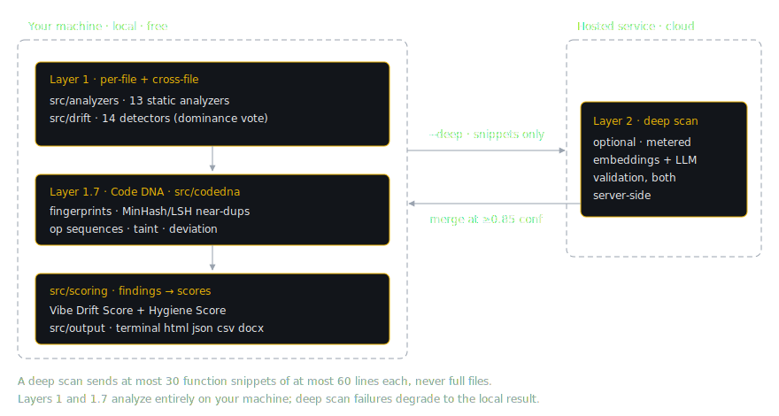

# System Architecture

VibeDrift is organized as a layered analysis pipeline. Each layer adds a more expensive kind of evidence, and the layers are strictly ordered by where they run: everything up to and including Layer 1.7 runs on the user's machine, and only the optional Layer 2 crosses the network. This chapter gives you the map: the layers, the repository layout, the high-level dataflow, and the design principles you will see enforced throughout the code.

## The layers

| Layer | Where | What it adds | Runs |
| --- | --- | --- | --- |
| 1 (static) | `src/analyzers/` | 13 per-file static analyzers: naming, imports, error handling, complexity, security rules, dead code, dependencies, and more | local, free |
| 1 (drift) | `src/drift/` | 14 cross-file drift detectors built on dominance voting: "8 of 10 files do X, these 2 deviate" | local, free |
| 1.7 (Code DNA) | `src/codedna/` | Semantic analysis over extracted function bodies: exact-duplicate fingerprints, MinHash/LSH near-duplicates, operation sequences, taint flows, deviation heuristics | local, free |
| 2 (deep scan) | `src/ml-client/`, `src/mcp/deep-client.ts` | A thin client for the hosted service: embedding-based duplicate detection, name-versus-behavior intent checks, anomaly detection, and LLM validation of borderline cases, all computed server-side | cloud, optional, metered |

**Layer 1** is two registries. `createAnalyzerRegistry()` in `src/analyzers/index.ts` returns the 13 static analyzers; `createDriftDetectors()` in `src/drift/index.ts` returns the 14 drift detectors, which map onto 13 drift categories (`commit-archaeology` folds its findings into `architectural_consistency`). Chapters 04 and 05 cover them individually.

> [!NOTE]
> The registries are the source of truth for these counts. Older docs in and around this repo cite "12 analyzers" or "8 detectors"; when a doc and a registry disagree, trust `src/analyzers/index.ts` and `src/drift/index.ts`.

**Layer 1.7** (`src/codedna/`) extracts functions once, then runs five analyses over them: semantic fingerprinting for exact duplicates, operation-sequence similarity, pattern classification, taint analysis, and deviation heuristics. Its MinHash/LSH machinery (`src/codedna/minhash.ts`) doubles as a shared primitive used by the `duplicates` analyzer, the `semantic-duplication` drift detector, the deep-scan sampler, the MCP baseline, and the one-vs-many body search. Chapter 07 covers it.

**Layer 2** is deliberately thin in this repo: request shaping, response filtering, and nothing else. When a scan runs with `--deep` and a signed-in token, `runMlAnalysis` (`src/ml-client/index.ts`) samples at most 30 function snippets of at most 60 lines each and posts them to the hosted `/v1/analyze` endpoint; embeddings and Claude validation run server-side, never in this repo. Duplicate, intent, and anomaly findings the server returns merge into the local result only at confidence 0.85 or higher (`src/ml-client/confidence.ts`), as `ml-duplicate`, `ml-intent`, and `ml-anomaly`; panel-confirmed reimplementation findings arrive already validated server-side and bypass that gate. The whole path is opt-in, metered, and fail-soft: if the call fails for any reason, the local scan completes and renders without it. Chapter 11 walks the boundary in detail, including exactly what is and is not transmitted.

## The scan dataflow, briefly

A scan (`runScan` in `src/cli/commands/scan.ts`) follows a fixed order: discover files and manifests (`src/core/discovery.ts`), parse them with tree-sitter (`src/utils/ast.ts`), run the static analyzers concurrently and reassemble findings in registry order, run drift detection, run Code DNA, optionally run the deep scan and cross-layer dedup, then hand everything to `computeScores` (`src/scoring/engine.ts`), which produces two parallel tracks: the Vibe Drift Score from drift-kind findings and the Hygiene Score from hygiene-kind findings. After scoring come the side effects (history, the MCP baseline, the anonymous beacon) and rendering. Chapter 03 walks every step with the flags that alter it; chapter 08 covers the scoring math.

## Repo map

Every directory under `src/`, one line each. All verified against the tree.

| Path | Purpose |
| --- | --- |
| `src/analyzers/` | The 13 per-file static analyzers plus their registry (`index.ts`) and shared `Analyzer` interface (`base.ts`) |
| `src/auth/` | Device auth flow, token storage and resolution (`~/.vibedrift/config.json`, mode 0600), plan gates |
| `src/cli/` | The Commander.js program (`index.ts`) and one file per command under `commands/` (the `telemetry` and `mcp` commands are wired inline in `index.ts`); `scan.ts` is the orchestrator |
| `src/codedna/` | Layer 1.7: function extraction, fingerprints, MinHash/LSH, op sequences, pattern classifier, taint, deviation heuristics, non-shippable path filter |
| `src/core/` | The spine: discovery, `types.ts` (`SourceFile`, `AnalysisContext`, `Finding`, `ScanResult`), import graph, baseline, scan history, findings cache, project config |
| `src/data/` | The bundled peer-percentile corpus (`score_percentiles.json`); currently a placeholder with an empty `languages` map, so percentile lookups return null |
| `src/drift/` | The 14 cross-file detectors, the dominance-vote utilities (`utils.ts`), the per-language security AST extractors, pivot detection, suppression audit |
| `src/intent/` | Parses team-declared conventions from `CLAUDE.md`, `AGENTS.md`, and `.cursorrules` into `IntentHint`s that seed the dominance vote |
| `src/mcp/` | The stdio MCP adapter (`server.ts`, `tools/`), plus the baseline provider and the deep-check plumbing (`deep-client.ts`, `deep-index.ts`, `candidate-feeder.ts`) |
| `src/ml-client/` | The Layer 2 wire client: sampler, confidence filter, embedding client, scan logging, result sanitization, report upload |
| `src/output/` | Pure presentation over a `ScanResult`: terminal, HTML, CSV, DOCX, context files, fix plans, history diff, floor badge, tease |
| `src/scoring/` | The engine (noisy-OR damage, geometric-mean composite), the category and kind registry (`categories.ts`), cross-layer dedup |
| `src/telemetry/` | The anonymous scan beacon and the report-open beacon (`beacon.ts`) |
| `src/tools-core/` | Channel-neutral implementations of the six tools (the five in-loop query/validate tools plus `init` setup), plus the nudge and finalize helpers; imports no MCP SDK |
| `src/types/` | Ambient TypeScript declarations (`tree-sitter-wasms.d.ts`) |
| `src/utils/` | Tree-sitter grammar loading (`ast.ts`), `.gitignore`/`.vibedriftignore` handling, small text and math helpers |
| `src/render.ts` | The public `./render` re-export surface: `renderHtmlReport`, `computeScores`, `estimateScoreAfterFixes` |

One structural quirk worth knowing early: `src/tools-core/` is the transport-free core of the in-loop tools, and `src/mcp/` is its stdio adapter, but `baseline-provider.ts` and the deep-check clients live under `src/mcp/` while being imported by `tools-core`. Neither directory is redundant. Chapter 09 covers the port-and-adapter split.

## Design principles as practiced

These are not aspirations; each one names the code that enforces it.

### Local-first

A scan works with zero network. `--local-only` gates every network call at one choke point in `src/cli/commands/scan.ts`: the auth banner, deep analysis, scan logging, fix-prompt synthesis, the beacon, and the update check. The MCP tools likewise run locally against a cached baseline and need no login. All state lives under `~/.vibedrift/` in directories keyed by a hash of the project path; nothing is written into the project tree except the opt-in `.vibedrift/` context files, `.vibedriftignore`, the opt-in `--inject-context` block in `CLAUDE.md`, and report files (with `--output`, or the local fallback write when a dashboard upload fails).

The honest caveat, stated here because the docs must never overclaim: a *default* scan does send one anonymous beacon and a daily npm update check, both disclosed and opt-out (chapter 10 lists the exact beacon fields). "Local-first" means the analysis is local and offline operation is a supported first-class mode, not that the default configuration makes zero network calls.

### Honesty over confidence

When the engine is not sure, it hedges or stays silent instead of guessing. The pattern recurs at every layer:

- The security detectors resolve auth to a three-way outcome (`auth`, `not-auth`, `unsure`), and `unsure` never counts as authenticated; it only softens the finding copy to "auth not confirmed, double check hook '...'". The strongest form is the **never-false-bless** law: the detector may over-flag, but it must never mark an unauthenticated route as authenticated (chapter 06).
- Surface-specific score categories with zero findings render as an explicit `N/A` line rather than earning a free 20/20, and the copy says why: "nothing to measure in this repo" when no applicable surface exists, or "not scored (evidence below floor); advisory findings below" when the peer floor demoted everything. The composite line carries an explicit scope note, "(over N of M categories)", so the headline never silently implies a full verdict (`src/output/terminal.ts`).
- The peer-percentile line renders nothing at all while the bundled corpus in `src/data/` is empty, for free and paid users alike: no capability is advertised that would currently return nothing.
- The deep-scan teaser names candidate counts, never unconfirmed pairs.
- When the scoring methodology changes, score deltas across versions are refused rather than computed, because subtracting numbers produced by different formulas misleads (`src/core/history.ts`, `src/core/scoring-notice.ts`).

### Determinism and testability

Same commit, same score. Discovery sorts directory entries by code-unit comparison and re-sorts the final file list (`src/core/discovery.ts`); analyzers run concurrently but their findings are reassembled in registry declaration order (`src/core/run-analyzers.ts`); finding digests bucket line numbers by `floor(line/3)` and normalize numbers out of messages so scan-over-scan diffs survive small edits (`src/core/history.ts`). Every cache carries a version knob that invalidates it wholesale when logic changes: `Analyzer.version`, `BASELINE_VERSION`, `HISTORY_SCHEMA_VERSION`, and `SCORING_VERSION` for the methodology itself.

Testability is enforced by calibration gates, not just unit tests: `npm run calibrate` measures per-detector precision and recall against synthetically injected drift and fails outright if the `security-floor` row drops below 0.95 precision; `npm run calibrate:monotonic` asserts the composite falls monotonically as injected drift rises; and the per-language security fixture suites (scenario families S0 through S11) run on every `npm test`. Chapter 12 covers all of them.

### Zero-dependency bias, where practical

When a small amount of hand-rolled code can replace a dependency, this codebase prefers the hand-rolled code: the DOCX renderer writes a minimal OOXML ZIP itself (`deflateRawSync` plus a CRC32 table in `src/output/docx.ts`) instead of pulling in a docx library; the `--include`/`--exclude` globs are matched by a dependency-free glob-to-regex translation (`src/core/file-filter.ts`); and this handbook's own build (`scripts/build-handbook.mjs`) is a zero-dependency Node script. The CLI is typically run via `npx` in other people's projects, so a small dependency tree keeps startup light and the supply-chain surface small. The bias is practical, not dogmatic: tree-sitter, Commander, and the MCP SDK earn their place.
