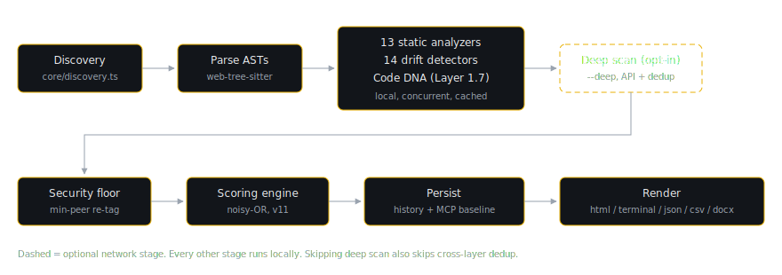

# The Scan Pipeline

`vibedrift scan` is the product. Everything else in the CLI (auth, watch mode, the MCP server, the git hook) exists to feed it or to consume its output. This chapter walks the pipeline end to end, from the moment the command parses to the moment a report renders, and closes with the full command surface and the configuration model.

The design constraint that shapes the whole pipeline: a scan must be complete, useful, and deterministic without any network access. Network stages (deep scan, dashboard upload, the anonymous beacon) are strictly additive and individually skippable, and `--local-only` turns all of them off at once.



## Orchestration overview

The orchestrator is `runScan` in `src/cli/commands/scan.ts`. In order, it:

1. Validates and resolves the target path. A bare argument that happens to match a known subcommand name (from a newer CLI than the one installed) triggers a "your CLI is out of date" hint instead of a confusing "path not found" error.
2. Resolves auth. `--deep` without a token exits with code 1 and a login hint; free scans do best-effort token resolution so results can sync to the dashboard. Under `--local-only` this step is skipped entirely.
3. Kicks off a passive update check in parallel with the scan (it respects the telemetry opt-out).
4. Runs the local analysis pipeline (`runAnalysisPipeline`): discovery, parsing, static analyzers, drift detectors, Code DNA.
5. Optionally runs the deep scan (`runDeepAnalysis`) and cross-layer dedup.
6. Builds the `ScanResult` (`buildScanResult`): security floor re-tag, scoring, scan-over-scan diff.
7. Writes the MCP baseline as a best-effort side effect, so the MCP server cold-starts without a full re-scan.
8. Fires the anonymous scan beacon (unless telemetry is disabled or `--local-only`).
9. Shows the one-time scoring-refined notice if the scoring methodology changed since the user's last scan (see the scoring chapter).
10. Persists the scan to history, writes context files if `--write-context` was passed, then uploads (if authenticated) and renders. `--fail-on-score` exits 1 when the composite lands below the threshold.

The subsections below take these stages in pipeline order.

## Discovery

Discovery (`buildAnalysisContext` in `src/core/discovery.ts`) walks the project tree and assembles the `AnalysisContext` every later stage reads: the source files with content, the language breakdown, project manifests (`package.json`, `go.mod`, `Cargo.toml`, `requirements.txt` or `pyproject.toml`, `.env.example`), git metadata, and intent files. The independent loads run under `Promise.all`.

Not everything on disk should be analyzed. Discovery applies four filters, each targeting a different failure mode:

| Filter | Rule | Why |
|---|---|---|
| Skip directories | `SKIP_DIRS` (`node_modules`, `.git`, `dist`, `build`, `.next`, `.nuxt`, `target`, `vendor`, `__pycache__`, `.venv`, `venv`, `coverage`, `.turbo`, `.cache`, `.idea`, `.vscode`) plus any directory starting with `.` | Dependency and build output is not the user's code |
| Ignore files | `.gitignore` and `.vibedriftignore`, both parsed with the `ignore` package | User-declared exclusions, one syntax |
| Vendored/minified files | `VENDORED_FILE_RE` (`*.min.js`, `*.bundle.js`, and variants), plus any file containing a line longer than `MAX_SOURCE_LINE_LENGTH` (2000 chars) | A checked-in jquery bundle would drown the drift vote in functions nobody wrote; hand-written source effectively never has a 2000-character line, so line length catches bundles regardless of filename |
| Caps | `MAX_FILE_SIZE` 1 MiB per file, `MAX_FILE_COUNT` 5000 files (with a truncation warning) | Bound memory and scan time on pathological inputs |

Language detection is extension-based (`src/core/language.ts`): `.js/.jsx/.mjs/.cjs`, `.ts/.tsx/.mts/.cts`, `.py`, `.go`, `.rs`. Files in any other language are skipped at discovery time, so the rest of the pipeline never sees a file it cannot analyze.

> [!IMPORTANT]
> Discovery is where scan determinism starts. Directory entries are sorted by plain code-unit comparison, deliberately not `localeCompare` (which is itself locale-dependent), because `readdir` order is filesystem-dependent: APFS returns sorted entries, ext4 returns hash order. The flattened file list is then re-sorted by `relativePath`. Every downstream map keyed by file inherits this order, so dominance-vote tie-breaks and `MAX_FILE_COUNT` truncation resolve identically on every machine and every clone.

After discovery, `--include`/`--exclude` globs filter the file set (followed by a stats recompute so line counts match the filtered set), and `--diff [ref]` scopes `ctx.files` to git-changed files. `--diff` falls back to a full scan with a warning when the directory is not a git repo, and exits 0 immediately when nothing changed. An empty file set prints "No source files found to analyze." and exits 0.

## Parsing: tree-sitter with a regex safety net

`parseFiles` (`src/utils/ast.ts`) attaches a tree-sitter AST to each discovered file. The whole parsing layer is 68 lines, but two decisions in it are load-bearing.

First, the dependency pinning. VibeDrift uses `web-tree-sitter` (the WASM build of tree-sitter, so there is no native compilation step at install time) with grammars from the `tree-sitter-wasms` package. Two workarounds live here:

- The grammar WASM files are loaded by direct file path, because `tree-sitter-wasms`' `main` field points at a nonexistent `bindings/node` and importing the package throws.
- `web-tree-sitter` is pinned to `^0.25.10` in `package.json`, because 0.26.x cannot load these grammar files at all (tree-sitter issue #5171, a wasm dylink ABI mismatch with grammars built by older tree-sitter-cli versions).

```typescript
// src/utils/ast.ts
const pkgJson = require.resolve("tree-sitter-wasms/package.json");
const wasmPath = `${pkgJson.slice(0, -"package.json".length)}out/tree-sitter-${grammarName}.wasm`;
const language = await Language.load(wasmPath);
```

Five grammars map to the five supported languages, with one special case: `.tsx` files get the `tsx` grammar, because the plain `typescript` grammar does not understand JSX. Loaded grammars are cached in a module-level `Map` so each grammar's WASM is loaded once per process.

Second, the failure mode. `parseFile` wraps everything in try/catch and returns `null` on any error; `parseFiles` stores `undefined` for the tree. Every analyzer that consumes ASTs checks `file.tree` and falls back to regex heuristics when it is absent (for example `src/analyzers/naming.ts`, `src/analyzers/complexity.ts`, `src/analyzers/dependencies.ts` all carry a regex path). A parse failure therefore degrades one file's analysis quality; it never aborts the scan. This matters in practice because real repos contain syntactically broken files mid-refactor, and a scanner that dies on them is a scanner people stop running.

## The concurrent analyzer pass (Layer 1, static)

`createAnalyzerRegistry()` (`src/analyzers/index.ts`) returns the 13 static analyzers. `runAnalyzers` (`src/core/run-analyzers.ts`) runs all of them concurrently via `Promise.all` and then reassembles their findings in declaration order.

Concurrency is safe because analyzers are pure and read-only over the context, and `Promise.all` preserves array order, so the flattened result is byte-identical to a sequential loop. The win is overlapping each analyzer's cache I/O; CPU-bound AST work still serializes on Node's single thread (worker threads are a deliberate deferral).

Each analyzer's output is cached in `~/.vibedrift/findings-cache/<project-hash>/` under a Merkle-style key: sha256 over the analyzer id, the analyzer's `version` field, and the sorted `relativePath:contentHash` tuples of the files that analyzer applies to (`src/core/findings-cache.ts`). Change one applicable file and only that analyzer's key changes; bump an analyzer's `version` when its logic changes and its stale cache invalidates itself. The cache has a 30-day TTL and a 500 MB cap, is pruned in the background after each scan, and is disabled by `--no-cache`. Chapter 4 covers the analyzers themselves.

## Cross-file drift detection (Layer 1, drift)

`runDriftDetection` (`src/drift/index.ts`) runs the 14 cross-file drift detectors returned by `createDriftDetectors`: architectural contradiction, convention oscillation, security consistency, semantic duplication, phantom scaffolding, import consistency, export consistency, async consistency, return-shape consistency, logging consistency, comment-style consistency, state-management consistency, test-structure consistency, and commit archaeology.

Unlike static analyzers, drift detectors judge each file against the repo's own dominant pattern: most of them build directory-scoped dominance votes (minimum group size 3, dominance threshold 0.7, entropy-gated, recency-weighted; the mechanics live in `src/drift/utils.ts` and the scoring chapter explains how the vote's outputs are consumed). Two enrichment passes then run over the raw findings: a pivot pass (`detectPivotsAcrossFindings`) that reclassifies deviating files as legacy migration candidates when git history shows a temporal majority shift, and an intent-divergence pass that stamps a finding with provenance when a team-declared pattern (from CLAUDE.md and similar intent files) disagrees with the voted dominant, so the UI can say "you declared X, the code does Y."

Finally each `DriftFinding` converts to the standard `Finding` shape via `driftFindingToFinding`, taking `analyzerId = "drift-<driftCategory>"` (for example `drift-import_style`). From this point on, static and drift findings flow through one shared pipe.

## Code DNA (Layer 1.7)

Unless `--no-codedna` is passed, `runCodeDnaAnalysis` (`src/codedna/index.ts`) runs five modules over a shared function extraction: semantic fingerprinting with duplicate grouping, operation-sequence similarity, pattern classification, taint analysis, and deviation heuristics. Its findings carry `codedna-*` analyzer ids (`codedna-fingerprint`, `codedna-pattern`, `codedna-taint`, `codedna-deviation`) and merge into the same findings stream; operation-sequence similarities are deliberately never surfaced as findings (workflow-shape similarity is a consistency signal, not duplicate evidence), and the `sequenceSimilarities` data is instead retained on the result for the report surfaces and the deep-scan tease. Code DNA is local and free; it exists to catch semantic redundancy and pattern deviation that line-level static analysis cannot see. It has its own chapter.

## Deep scan (Layer 2): the interface

Deep scan runs only when all three of `--deep`, a resolved bearer token, and not `--local-only` hold. `runDeepAnalysis` (`src/cli/commands/scan.ts`) calls `runMlAnalysis` (`src/ml-client/`), which POSTs a sampled set of function snippets (at most 30, at most 60 lines each) to the VibeDrift API; only the `highConfidence` findings that come back merge into the local findings (validation of borderline findings happens server-side, and unresolved "maybe" findings are deliberately not shipped as findings). On any failure the error prints and the local scan continues unchanged. After the merge, `deduplicateFindingsAcrossLayers` (`src/scoring/dedup.ts`) collapses the same duplicate pair reported by multiple layers, keeping the highest-priority detection: `ml-duplicate` over `codedna-fingerprint` over `codedna-opseq` over `duplicates`. Note that this dedup pass only exists on the deep path; a free scan never calls it because static and Code DNA duplicate findings are distinct enough to keep.

## Building the result: floor re-tag, scoring, diff

`buildScanResult` (`src/cli/commands/scan.ts`) turns the raw findings into the `ScanResult` that everything downstream consumes:

- It loads the previous scan's scores, hygiene scores, and `scoringVersion` from history, so deltas and the scan-over-scan diff have a baseline.
- **Security min-peer floor, applied to the render set.** `applySecurityMinPeerFloor` (`src/scoring/engine.ts`) re-tags route-consistency security findings backed by fewer than 4 peer routes to an advisory hygiene id, in place, before the findings become `result.findings`. The scoring engine applies the same floor internally on its own copy; applying it here too means every renderer sees the demoted id, so no export can contradict the category's N/A. `scoredDriftView` (`src/drift/index.ts`) performs the matching filter on the raw drift-finding view at one source point for the same reason.
- **`computeScores`** produces the drift and hygiene score tracks, per-file scores, the peer percentile, and the `previousScoresMismatch` flag (the scoring chapter covers all of it).
- **Scan-over-scan diff.** On by default when history exists (`--no-compare` opts out, `--since <scanId>` picks a specific baseline), `diffScans` compares finding digests: sha256-16 keys over `analyzerId`, file, the line bucketed by `floor(line/3)` (so a finding survives small edits above it), and the message with numbers normalized to `N`. Digests, not full findings, because history stores at most 200 finding digests and 100 drift digests per scan.

## Persistence

All persistent state lives under `~/.vibedrift/`, keyed by a hash of the project path, never inside the project tree. The only project-tree writes are the opt-in `.vibedrift/` context files, `.vibedriftignore`, and reports you explicitly ask for.

| Store | Path | Contents |
|---|---|---|
| Scan history | `~/.vibedrift/scans/<project-hash>/scan-<ts>.json` | Timestamp, both score tracks, finding digests, `scoringVersion`; schema v3, retention 10 scans (`src/core/history.ts`) |
| Findings cache | `~/.vibedrift/findings-cache/<project-hash>/` | Per-analyzer findings keyed by content hashes; 30-day TTL, 500 MB cap |
| MCP baseline | written by `assembleBaseline` + `writeBaseline` as a scan side effect | The repo drift baseline the MCP server reads to answer in-loop queries without a cold scan |
| User config | `~/.vibedrift/config.json` | Auth token, telemetry preference, cached plan, `lastSeenScoringVersion` |

One subtlety: history saves the raw drift-finding digests, not the floor-filtered render view, so scan-over-scan continuity is preserved even when a finding hovers around the security peer floor between scans.

## Rendering and exit codes

`logAndRender` uploads the scan to the dashboard when authenticated (with a sanitized result and a letter grade: A at 90+, B at 75+, C at 50+, D at 25+, F below), then renders in the requested format: `html` (default), `terminal`, `json`, `csv`, or `docx`.

The HTML path splits on auth state. Unauthenticated scans serve the full report on `http://localhost:<port>` (port is 4173 plus a random offset under 100) with a 10-minute auto-close timer, so a first-run user gets a real report with zero account friction. Authenticated scans print a concise summary and link the dashboard copy; a local HTML file is written only when the upload failed or `--output` was given.

`--format json` keeps stdout machine-clean: the result JSON is the only thing on stdout, and every notice goes to stderr. This is what makes `vibedrift --json | jq .compositeScore` reliable in CI. Finally, `--fail-on-score <n>` calls `process.exit(1)` when the composite score is below the threshold, which is the entire CI integration surface.

## The CLI command surface

The program is built with Commander.js in `src/cli/index.ts`. There are 16 commands; `scan` is the default (registered with `isDefault: true`), so `vibedrift .` and plain `vibedrift` both scan.

| Command | What it does |
|---|---|
| `scan [path]` | Full local scan of a project; the default command |
| `init [path]` | Guided one-time setup: writes `.vibedriftignore` and `.vibedrift/config.json` |
| `ignore <patterns...>` | Appends glob(s) to `.vibedriftignore` (idempotent) |
| `watch [path]` | Reruns the scan and refreshes `.vibedrift/` outputs on file changes; `--interval` debounce, default 10s; local-only |
| `telemetry <enable\|disable>` | Flips the anonymous-beacon opt-out in `~/.vibedrift/config.json` |
| `login` | Device auth flow; stores the bearer token |
| `logout` | Logs out and revokes the current token |
| `status` | Shows the current account, plan, and token |
| `usage` | Shows the current billing period's scan usage |
| `upgrade` | Opens the pricing page |
| `billing` | Opens the Stripe Customer Portal |
| `doctor` | Diagnoses installation, auth, and API connectivity |
| `update` | Self-updates the CLI |
| `feedback [message...]` | Sends feedback to the maintainer (interactive when no message given) |
| `hook <install\|uninstall\|status>` | Manages a git pre-push hook that blocks pushes below a drift-score threshold (default 70) |
| `mcp` | Runs the long-lived stdio MCP server; stdout is the JSON-RPC channel, logs go to stderr |

The `scan` command carries the bulk of the flags: output (`--format`, `--output`, `--json`, `--fail-on-score`), analysis toggles (`--no-codedna`, `--no-cache`, `--deep`, `--local-only`), file filtering (`--include`, `--exclude`, both repeatable, and `--diff [ref]`), context emission (`--write-context`, `--inject-context`), identity (`--project-name`, `--private`), diffing (`--compare`, `--no-compare`, `--since`), plus `--verbose` and the hidden `--api-url` override.

Environment variables: `VIBEDRIFT_TOKEN` (overrides the stored token), `VIBEDRIFT_API_URL`, `VIBEDRIFT_NO_BROWSER`, and `VIBEDRIFT_TELEMETRY_DISABLED=1` (equivalent to `vibedrift telemetry disable`).

## Configuration: files and precedence

VibeDrift has exactly two project-level files and one user-level file, with distinct jobs.

**`.vibedrift/config.json`** (project, meant to be committed; `src/core/project-config.ts`) holds behavior: `version` (schema version, currently 1), `format` (default report format), `failOnScore` (a CI score floor that applies even without the flag), and `security.allowlist` (gitignore-style globs; a matching route is excluded from the security dominance vote entirely, the same suppression the inline `@vibedrift-public` annotation gives a single route, declared once for a whole directory). `normalizeProjectConfig` drops unknown or out-of-range fields rather than erroring, so an old CLI reading a newer config degrades gracefully. `vibedrift init` creates it.

Precedence is: explicit CLI flag, then project config, then built-in default. The wiring distinguishes a real `--format html` from Commander's built-in default via `command.getOptionValueSource("format") === "cli"`, so the project config only fills in values the user did not state.

**`.vibedriftignore`** (project; `src/utils/vibedriftignore.ts`) uses gitignore syntax and is honored by both the scan and the MCP server, because both go through the same `loadGitignore` helper that layers `.gitignore` then `.vibedriftignore`. The scan actively nudges toward it: when at least 5 scanned files sit under fixture-like paths (`fixtures/`, `__mocks__/`, `snapshots/`, `generated/`, or `*.generated.*` names), it prints a ready-to-paste `vibedrift ignore ...` suggestion (never in `--format json` mode).

**`~/.vibedrift/config.json`** (user; `src/auth/config.ts`) holds the auth token, telemetry preference, and cached plan. It is deliberately separate: a project config is shared with a team via git, and secrets and personal preferences must never travel with it.

> [!TIP]
> `--include`/`--exclude` use a small dependency-free glob dialect (`*`, `**`, `?`, `{a,b}`, `[abc]`, trailing `/`) matched against the relative path. It does not support `!` negation; use `.vibedriftignore` for durable exclusions and the flags for one-off slicing.

> [!NOTE]
> `--local-only` is the single switch that gates every network touch: the auth banner, deep scan, dashboard upload, fix-prompt synthesis, the anonymous beacon, and the update check. It also forces `deep: false` even if `--deep` was passed. If you are auditing what the CLI sends, this is the flag to test against.
