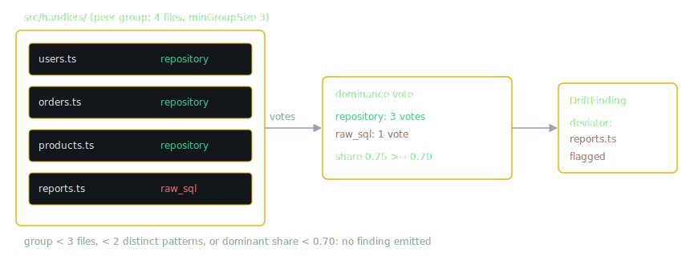

# Cross-File Drift Detection

Single-file analyzers can tell you a function is too long. They cannot tell you that this file handles errors differently from every one of its neighbors. That second kind of signal, a file disagreeing with its own codebase, is what VibeDrift calls drift, and it is what the cross-file drift detectors measure.

`createDriftDetectors()` in `src/drift/index.ts` registers 14 detectors. Eight of them are the canonical set this chapter walks through in detail: architectural consistency, naming conventions, security posture, semantic duplication, phantom scaffolding, import style, export style, and async patterns. The remaining six reuse the same machinery and are listed briefly at the end. Security posture is registered here like any other detector, but its internals are deep enough that it gets its own chapter (the next one).

Every detector implements the same small contract from `src/drift/types.ts`:

```ts
// src/drift/types.ts
export interface DriftDetector {
  id: string;
  name: string;
  category: DriftCategory;
  detect(ctx: DriftContext): DriftFinding[];
}
```

A `DriftFinding` carries the vote outcome, not just a complaint: `dominantPattern` (what the codebase does), `dominantCount` and `totalRelevantFiles` (the vote tally), `consistencyScore` (dominant over total, times 100), `deviatingFiles` (who broke the convention and how), and up to three `dominantFiles` exemplars a fix can copy from. Detectors that count phenomena rather than vote (duplicate pairs, dead exports) set `countBased: true` so the scoring engine treats them differently, as described below.

## The dominance vote

The backbone of every detector is the dominance vote, documented at the top of `src/drift/utils.ts`: profile each file's pattern, aggregate the primary patterns into a distribution, pick the majority as the baseline, and flag the minority as deviators. Drift is always measured against the repo's own behavior, never against an external style guide.

There are two scoping modes, and each detector picks one per axis:

- **Project-scoped**: `buildPatternDistribution` plus `findDominantPattern` plus `collectDeviatingFiles` over the whole file set. Used when a convention should hold everywhere (symbol naming is the main example: readers should not have to context-switch per directory).
- **Directory-scoped**: `buildDirectoryScopedVote` groups files by their enclosing directory and votes inside each group. This is the sharper, lower false-positive mode, because a minority directory with an internally consistent convention is not drift. A legacy `utils/` on `.then()` chains next to a new `handlers/` on async/await should produce zero findings.

The directory-scoped algorithm, from `src/drift/utils.ts`:

1. Group file profiles by directory.
2. Skip any group smaller than `minGroupSize` (default 3): two files cannot outvote each other meaningfully.
3. Skip a group with fewer than 2 distinct patterns: everyone agrees.
4. Pick the dominant pattern. Skip the group if its share is below `dominanceThreshold` (default 0.7): without a strong majority there is no convention to deviate from.
5. Emit the minority files as deviators.



Both thresholds are per-call options, but every canonical detector that runs the directory vote passes `minGroupSize: 3` and `dominanceThreshold: 0.7`. (Three of the eight canonical detectors never call it: security posture runs its own ratio vote, and semantic duplication and phantom scaffolding are count-based, with no vote at all.) Iteration order is deterministic (directories sorted ascending) so the same repo always yields the same findings in the same order.

Before a vote runs, most detectors filter the file set through `isAnalyzableSource` (`src/drift/utils.ts`): tests, specs, mocks, fixtures, config files, `.d.ts` declarations, `node_modules`, `dist`, and `build` output never vote and never get flagged. A convention in test scaffolding is not evidence about production code. Two exceptions apply their own filtering instead: the project-wide symbol-naming vote iterates every file, and phantom scaffolding works from the import graph.

## The entropy gate

A vote assumes a convention exists. When a project genuinely has no convention on some axis (four import styles, evenly split), flagging the "minority" would scold arbitrary files for deviating from an arbitrary plurality. The entropy gate (`entropyGate` in `src/drift/utils.ts`) decides which situation you are in.

It computes the normalized Shannon entropy of the pattern distribution: `H / log2(k)` for `k` distinct patterns, which is 0 for a unanimous distribution and 1 for a perfectly even split. If normalized entropy exceeds 0.8, the decision is `no_convention` with confidence 0.75, and the detector emits a single category-level finding instead of per-file flags. Otherwise the decision is `flag_deviators` with confidence `clamp(1 - H_norm, 0.3, 0.9)`: the tighter the convention, the more confident the detector is that a deviation is real drift.

The `no_convention` finding (`noConventionFinding`) is not a free pass. For a self-consistency score, "no dominant pattern" is the floor of consistency, not the absence of a signal, so the finding's `consistencyScore` is the plurality share times 100 (a smooth measure of chaos depth, deliberately not the saturating entropy value, so progressively more mixed repos score monotonically lower). It names no deviating files, because there is no majority to deviate from, and it only fires with at least `MIN_NO_CONVENTION_FILES = 5` files on the axis: a 1-vs-1 split is sparse data, not chaos.

## Temporal decay

When git metadata is available, a file's vote is weighted by how recently it was touched (`temporalWeight` in `src/drift/utils.ts`):

```text
weight = 2.0 * e^(-ln(2) * daysAgo / 90)
```

A just-touched file votes at 2x, a 90-day-old file at 1x, a 180-day-old file at 0.5x, and a year-old file at roughly 0.12x. The point is to let three recent files outvote ten old ones when the codebase is actively migrating away from an old pattern: the convention you are moving toward should win the vote even before it wins the file count. Files with no git metadata weigh 1.0, so repos scanned without history behave exactly as before temporal weighting existed (`buildFileAgeMap` returns undefined and the whole mechanism switches off).

A separate post-pass, `detectPivotsAcrossFindings` (`src/drift/pivot-detector.ts`, invoked from `src/drift/index.ts`), goes one step further: when the recent files decisively use pattern B while older files use pattern A, deviators aligned with A are reclassified as `legacy` migration candidates rather than drift. Being on the old side of a deliberate migration is a different problem from breaking a live convention, and the report says so.

## Intent seeding and the anti-laundering rule

Teams declare conventions in `CLAUDE.md` and `AGENTS.md` files. VibeDrift parses these into intent hints, and `pickIntentHint` (`src/drift/utils.ts`) selects the strongest hint per category, ignoring anything below a 0.6 confidence floor.

`seedDominanceVote` folds the hint into the vote. If the declared pattern already appears in the distribution, its weight is multiplied by `intentBoost` (1.5x). If it does not appear at all, a virtual entry is injected with weight `1 + hint.confidence`, so a high-confidence declaration carries roughly the weight of two files: strong enough to flip a close vote, not strong enough to override a broad consensus. Inside directory-scoped votes the boost is applied after temporal weighting, and a seeded vote also skips the 0.7 dominance threshold, because the declaration itself is a signal worth reporting whether or not the code has converged. A directory that is unanimous on the wrong pattern (unanimity would normally mean "skip, no drift") still emits a vote entry when a hint declares something else: the whole directory ignoring the declaration is exactly the finding.

> [!IMPORTANT]
> The anti-laundering rule: `declaredMatched` is computed from the raw, unboosted code dominant, never from the boosted result. If the declaration's 1.5x boost is what flipped the vote, the code does not actually follow the declaration, and reporting "matched" would launder an unconverged split into a green checkmark. A boost-driven flip therefore still reports divergence, and the `flipped` field marks it as the strongest possible evidence that the codebase has not converged.

A second post-pass in `src/drift/index.ts` stamps `intentDivergence` provenance onto findings where the declared pattern and the voted dominant disagree, so renderers can show "you declared X, the code does Y" with the declaration's source file and line.

## From finding to score

Drift findings feed the composite Vibe Drift Score through a strict, typed pipeline in `src/drift/index.ts` and `src/scoring/engine.ts`.

`driftFindingToFinding` converts each `DriftFinding` into the standard `Finding` shape with `analyzerId = "drift-<driftCategory>"`, keyed off the typed `DriftCategory` enum rather than the detector's freeform `detector` string. That distinction matters: keying off the freeform string was, per the comment in `src/drift/index.ts`, the root of a wiring bug that silently excluded 11 of 14 detectors from the score. The one exception is the security suppression audit, which maps to the hygiene analyzer id `security-suppression` instead.

`src/scoring/categories.ts` registers every `drift-*` analyzer id as kind `"drift"`, and only drift-kind findings feed the composite. `security_posture-advisory` and `security-suppression` are registered as hygiene: they render in reports but can never move the score.

Vote-based findings carry a `driftSignal { consistencyScore, dominantCount, totalRelevantFiles }` so the engine can weight damage by how inconsistent the category actually is: deviation for a dominance group is `1 - consistencyScore/100`, a rate that is already size-normalized. Count-based findings (`countBased: true`) omit the signal and take the engine's density branch instead, which saturates on findings per function or per KLOC, because a raw pair count has no meaningful peer ratio.

Inside the engine, findings are grouped by analyzer and combined with a noisy-OR: `health = product over detectors of (1 - damage)`, where each detector's damage is `min(0.85, severity x confidence x importance x deviation x sampleConfidence)`. Severity maps to damage through `SEVERITY_DAMAGE = { error: 0.7, warning: 0.4, info: 0.12 }`, and `sampleConfidence` ramps up to 1.0 at `SAMPLE_FULL_CONFIDENCE = 8` relevant files, so a 70 percent majority over 4 files carries half the damage weight of the same majority over 8.

The per-category report bars come from `computeDriftScores` (`src/drift/index.ts`): each category's bar is `DRIFT_WEIGHTS[category] x categoryHealth(...)`, using the same noisy-OR the composite uses. This is a faithful decomposition of the composite, deliberately not a second formula. The display weights, from `src/drift/types.ts`:

| Category | Bar max | Category | Bar max |
|---|---|---|---|
| architectural_consistency | 16 | return_shape_consistency | 12 |
| security_posture | 14 | state_management_consistency | 10 |
| semantic_duplication | 14 | export_style | 10 |
| naming_conventions | 12 | async_patterns | 10 |
| phantom_scaffolding | 12 | logging_consistency | 8 |
| import_style | 12 | test_structure_consistency | 6 |
| | | comment_style_consistency | 5 |

## The canonical detectors

Each section below gives the drift definition, the algorithm, the thresholds, and a concrete before/after: code that gets flagged, the finding VibeDrift emits, and what alignment looks like.

### Architectural consistency

**File:** `src/drift/architectural-contradiction.ts`. **Drift:** a file whose directory peers use a different pattern on one of four axes: data access (repository, raw SQL, ORM, direct DB, HTTP client, in-memory), error handling (wrap with context, raw propagation, swallow, HTTP error response, exception throw, result type), config access, and dependency injection.

**Algorithm:** regex evidence extraction per axis per file (repository usage matches `/\b(?:store|repo|repository)\.\w+\s*\(/g`; raw SQL matches `SELECT`/`INSERT`/`UPDATE`/`DELETE` statements outside repository-named files), then one directory-scoped vote per axis with `minGroupSize: 3` and `dominanceThreshold: 0.7`. It needs at least 3 profiled files overall. Files that show no signal on the data-access, error, or config axes are excluded from those votes entirely, but files with no DI signal get an explicit `no_di` sentinel, because "no dependency injection" is itself a pattern that can legitimately win a vote. A single intent hint seeds all four axes. Confidence 0.85; severity `error` at 3 or more deviators, `warning` below.

**Before** (in `src/handlers/`, where three sibling files go through a repository):

```ts
// src/handlers/reports.ts
export async function getReport(id: string) {
  const rows = await db.query(`SELECT * FROM reports WHERE id = $1`, [id]);
  return rows[0];
}
```

VibeDrift reports:

```text
src/handlers/: 1 file(s) use raw SQL queries while 3 use repository pattern
```

with the recommendation "In src/handlers/, 3 of 4 files use repository pattern. Migrate deviating files for consistency."

**After:** `return store.findReport(id);`, matching the peers. The vote still runs but the group is unanimous, so no finding is emitted.

`classifyDataAccessLabel` is exported from this module so the MCP `validate_change` in-loop check speaks the identical pattern vocabulary; the batch scan and the in-loop check can never describe the same file in different words.

### Naming conventions

**File:** `src/drift/convention-oscillation.ts`. **Drift:** two distinct things. Symbol names (functions, classes, types) oscillating between conventions project-wide, because readers should not context-switch naming styles per directory, and file basenames deviating from their own directory's convention, which legitimately varies by subsystem.

Recognized conventions: camelCase, snake_case, PascalCase, SCREAMING_SNAKE, kebab-case. Idiomatic exceptions are filtered before the vote so they neither vote nor get flagged: classes are expected to be PascalCase in JS/TS and Python, Go exported identifiers are PascalCase with initialisms like HTTP and URL respected, Python dunders pass, and SCREAMING_SNAKE constants pass.

**Thresholds:** the symbol vote runs only with at least 5 symbols total, and fires per symbol type only when there are at least 3 symbols of that type, at least 2 conventions present, at least 3 deviants that are also at least 10 percent of the symbols, spread over at least 2 files. Confidence 0.8; severity `error` above 5 deviating files. The file-name vote is directory-scoped (3 / 0.7, temporally weighted, intent-seeded), confidence 0.75, `warning` at 3 or more deviators, else `info`. A single-token all-lowercase basename like `index` or `render` expresses no convention and is neutral.

**Before** (a project whose functions are camelCase in 40 places):

```ts
// src/services/report.ts
export function build_report_summary(rows: Row[]) { /* ... */ }
```

With six such snake_case functions across two or more files, VibeDrift reports:

```text
function naming convention oscillates: 40 use camelCase, 6 use other conventions
```

and the finding copy attributes the oscillation to likely coming from different AI sessions.

**After:** rename to `buildReportSummary` (deviants drop below the 3-and-10-percent gate, the finding disappears).

### Security posture

**File:** `src/drift/security-consistency.ts`, id `security-consistency`, category `security_posture`. **Drift:** a route missing a security property (authentication, input validation, rate limiting) that its peer routes have. This is the deepest detector in the codebase, with per-language AST extraction across JS/TS, Python, Go, and Rust and a strict never-false-bless invariant. It gets the whole next chapter; this chapter only notes that it plugs into the exact same vote-and-score pipeline as every other detector here.

### Semantic duplication

**File:** `src/drift/semantic-duplication.ts`. **Drift:** cross-file pairs of functions with near-identical normalized token streams: the rename-refactor case, where an AI session reimplemented `formatCurrency` as `toUSD` instead of importing it. The detector deliberately does not catch same-control-flow-different-API pairs: call targets are preserved during normalization, so two functions that do genuinely different work in the same shape stay distinct.

**Algorithm:** extract functions per file, build a MinHash signature per body, generate candidate pairs with LSH (locality-sensitive hashing, which buckets similar signatures so the detector never compares all pairs), verify each candidate with LCS (longest common subsequence) similarity over the normalized tokens, cluster with union-find, and roll findings up per directory.

**Thresholds:** flag at LCS similarity of at least `FLAG_THRESHOLD = 0.7`; bodies under `MIN_BODY_TOKENS = 15` tokens are skipped (trivial getters would all match each other); a length-ratio pre-filter requires `shorter/longer >= 0.6`; same-file pairs are skipped (a file duplicating itself is a single-file concern). Severity is driven by duplicate strength, not count: `error` when max similarity is at least 0.95 and the cluster has at least 3 members, `warning` when max similarity is at least 0.85 or the cluster has at least 3 members, else `info`. Confidence 0.85, `countBased: true`.

**Before:**

```ts
// src/utils/currency.ts
export function formatCurrency(amount: number): string {
  if (!Number.isFinite(amount)) return "$0.00";
  const rounded = Math.round(amount * 100) / 100;
  const sign = rounded < 0 ? "-" : "";
  return `${sign}$${Math.abs(rounded).toFixed(2)}`;
}

// src/helpers/money.ts
export function toUSD(value: number): string {
  if (!Number.isFinite(value)) return "$0.00";
  const rounded = Math.round(value * 100) / 100;
  const sign = rounded < 0 ? "-" : "";
  return `${sign}$${Math.abs(rounded).toFixed(2)}`;
}
```

VibeDrift reports, per directory:

```text
src/utils/: 1 pair(s) of semantically duplicate functions detected (MinHash + LCS verified)
```

with per-file evidence naming the partner: `formatCurrency()` reported as 100 percent similar to `toUSD()` at `src/helpers/money.ts` and its line number.

**After:** delete one implementation and import the other. The pair disappears from the candidate set entirely.

### Phantom scaffolding

**File:** `src/drift/phantom-scaffolding.ts`. **Drift:** exported CRUD-named handlers nobody uses. As the module header puts it, AI sessions love generating "complete" CRUD handlers that never get wired up.

**Algorithm:** build the JS/TS import graph (`src/core/import-graph.ts`), extract route registrations across all languages by regex (Go Echo `.GET("/p", h)`, Gorilla `HandleFunc`, Express `.get('/p', h)`, Flask/FastAPI decorators with the following `def`). An export is phantom if and only if all three hold: its name is CRUD-like (the `isCrudLike` regex matches prefixes from `create`, `add`, `get`, `find`, `update`, `delete`, `remove` through `purge`), it appears in no route table, and its file has zero incoming imports. Findings roll up per directory.

**Thresholds:** severity by dead share, the fraction of the directory's CRUD-like exports that are phantom: `error` at 0.5 or more, `warning` at 0.2 or more, else `info`; when the population is unknown the fallback is `error` at 8 or more phantoms and `warning` at 3 or more. Confidence 0.8, `countBased: true`. The import graph is JS/TS only; Go and Python phantoms are handled by the `dead-code` analyzer instead (`src/analyzers/dead-code.ts`), and Rust currently has no phantom or dead-export coverage at all.

**Before:**

```ts
// src/handlers/admin.ts (no file imports this module)
export async function deleteUser(id: string) { /* ... */ }
```

If `deleteUser` never appears in any route registration, VibeDrift reports a phantom export for `src/handlers/`, with per-export evidence stating it has no incoming imports and sits in no route table.

**After:** either wire it up (`router.delete('/users/:id', deleteUser)` puts it in the route table) or delete it.

### Import style

**File:** `src/drift/import-consistency.ts`, with per-language classifiers in `src/drift/import-style/`. **Drift:** a file whose import style deviates from its directory peers on any one of several independent **axes**. Axes are voted separately, so a file can be consistent on one dimension and drift on another:

- **JS/TS** — `path_style`: `relative` (`./`, `../`) versus `alias` (`@/`, `~/`), for both ES `import … from` and CommonJS `require()`. `import type` lines are skipped (they vanish at build time), as are external packages (no path-style choice to make).
- **Go** — `go_grouping` (stdlib/external separated into blank-line groups vs one flat block) and `go_ordering` (gofmt byte-order within each group).
- **Python** — `py_path_style` (absolute `from pkg.mod` vs relative `from .mod`) and `py_wildcard` (`from x import *` vs explicit names).
- **Rust** — `rust_glob` (`use …::*` vs explicit; idiomatic relative globs and external `::prelude::*` are excluded), `rust_use_path` (`crate::` vs `super::`/`self::`), and `rust_grouping` (origin-grouped vs flat).

Each classifier is AST-first with a regex fallback (`src/drift/import-style/{js,go,python,rust}.ts`), behind a shared `ImportStyleClassifier` interface dispatched by language.

**Algorithm and thresholds:** everything below runs **per axis**. A file needs at least 3 local imports to be classified on the JS/TS path axis (other axes have their own minimums), and its majority style wins. Each axis needs at least 3 profiled files. A project-level entropy gate runs first: high entropy emits one "no dominant convention" finding for that axis instead of per-directory flags. Otherwise a directory-scoped vote runs at 3 / 0.7 with temporal weighting; intent seeding applies only to the axis a declared convention names (e.g. an `alias` declaration seeds `path_style`, never `go_grouping`). Severity `warning` at 3 or more deviators, else `info`; confidence comes from the entropy gate.

**Before** (in `src/routes/`, where five peers import through the alias):

```ts
// src/routes/billing.ts
import { getInvoice } from "../services/invoices";
import { requireAuth } from "../middleware/auth";
import { log } from "../utils/log";
```

VibeDrift reports:

```text
Import path style in src/routes/: 5 files use path aliases (@/), 1 deviate
```

**After:** switch the three imports to `@/services/invoices`, `@/middleware/auth`, `@/utils/log`.

### Export style

**File:** `src/drift/export-consistency.ts`. **Drift:** a file breaking its directory's export convention: `default_export` (any `export default` or `module.exports =`) versus `named_only`. Barrel and `index.*` files are excluded because re-exporting neighbors is their job, not a style choice.

**Algorithm and thresholds:** same pipeline as import style. At least 3 files, project entropy gate first, then a directory-scoped vote at 3 / 0.7. Severity `warning` at 3 or more deviators; confidence from the gate.

**Before** (in `src/models/`, four named-only peers):

```ts
// src/models/session.ts
export default class Session { /* ... */ }
```

VibeDrift reports:

```text
Export style in src/models/: 4 files use named exports only, 1 deviate
```

and the recommendation notes that consistent named exports help tree-shaking.

**After:** `export class Session { ... }` and update the import sites.

### Async patterns

**Files:** `src/drift/async-consistency.ts` plus the shared classifier `src/drift/async-style.ts`. **Drift:** a file's async style deviating from its directory peers. The classification logic lives in its own module explicitly so the batch detector and the MCP `validate_change` tool can never disagree about what style a file uses.

`classifyAsyncStyle` returns null under 2 async operations (too little signal to classify), `async_await` when the await ratio exceeds 0.7, `then_chains` below 0.3, and `mixed` in between. Comment lines are excluded from both counts, and `type`/`interface` lines are additionally excluded from the `.then(` count, so a comment saying "we used to use .then here" cannot change a file's classification.

**Algorithm and thresholds:** JS/TS only, at least 3 profiled files, entropy gate first, then a directory-scoped vote at 3 / 0.7 with temporal weighting and intent seeding. Severity `warning` at 3 or more deviators; confidence from the gate. Directory scoping is the false-positive fix here: a legacy directory consistently on `.then()` chains is not flagged just because newer directories use async/await.

**Before** (in `src/handlers/`, four async/await peers):

```ts
// src/handlers/webhooks.ts
export function handleWebhook(req: Request) {
  return verifySignature(req)
    .then((ok) => (ok ? processEvent(req.body) : rejectEvent(req)))
    .then((result) => ({ status: 200, result }));
}
```

VibeDrift reports:

```text
Async style in src/handlers/: 4 files use async/await, 1 deviate
```

**After:** rewrite with `async`/`await`; the file's await ratio moves above 0.7 and it joins the majority.

## The other six detectors

The remaining registered detectors follow the same profile-vote-emit machinery:

- **Return-shape consistency** (`return-shape-consistency.ts`): sibling handlers mixing error idioms, one throwing, one returning `{ status: 404, error }`, one returning `null`. Each choice is valid alone; the drift is the mix.
- **Logging consistency** (`logging-consistency.ts`): mixed logger families in one project (`console.log`, `winston.info`, `debug()`), classified per file and put through the standard dominance vote.
- **Comment style consistency** (`comment-style-consistency.ts`): JSDoc in some files, plain `//` in others, none in a third set. Low signal by design: it emits a single project-summary finding at `info` level rather than per-file flags.
- **State management consistency** (`state-management-consistency.ts`): mixing state strategies in React/Vue/Svelte projects (local hooks, context, Redux, Zustand, React Query, MobX, Pinia, Vuex).
- **Test structure consistency** (`test-structure-consistency.ts`): test files only; votes on test framework style (BDD `describe`/`it` versus flat `test()`) and mocking style (framework mocks, sinon, manual), project-scoped because test conventions usually span the whole project.
- **Commit archaeology** (`commit-archaeology.ts`): a git-history shape detector; a file whose authorship pattern stands out from the repo's norm (one author, one large burst, no refinement trail) is a drift signal about how the code was produced. It reports under `architectural_consistency`, which is why 14 detectors produce 13 score categories.
