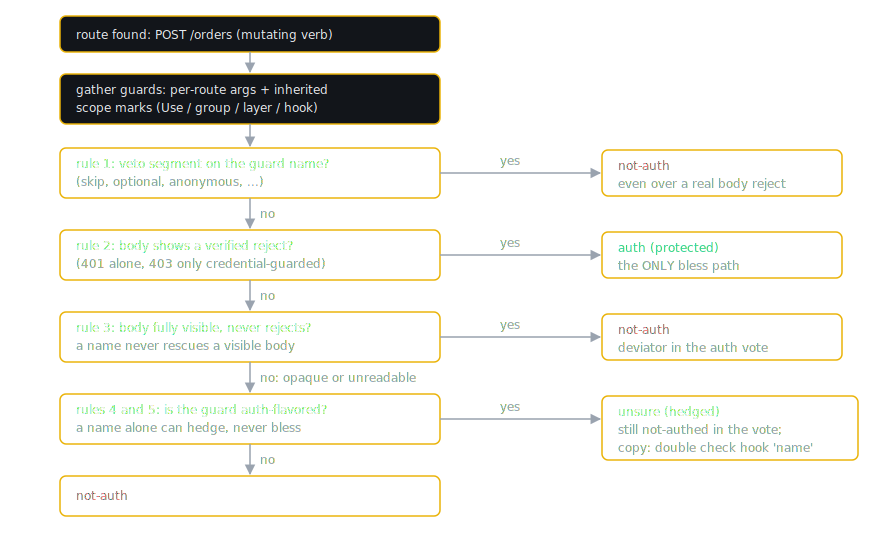

# Security Consistency: Auth Drift Across Languages

The security posture detector is the deepest single subsystem in VibeDrift: a 697-line orchestrator (`src/drift/security-consistency.ts`) backed by four language-specific AST extractors (`security-ast.ts` for JS/TS, `security-ast-python.ts`, `security-ast-go.ts`, `security-ast-rust.ts`), a cross-file symbol index (`security-xfile-index.ts`), a suppression module (`security-suppression.ts`), and an in-loop twin for the MCP tools (`route-auth-classify.ts`). This chapter explains how it works and, more importantly, why it is built the way it is.

## Philosophy: drift, not SAST

VibeDrift does not ship a vulnerability scanner. It does not know CVEs, does not taint-track user input to a sink in this detector, and does not carry an opinion about whether your API should require authentication. What it measures is consistency: given how this repository protects its own routes, which routes fall short of that baseline?

The drift definition is: a route missing a security property (authentication, input validation, or rate limiting) that its peer routes have. If 8 of your 9 mutating routes go through `requireAuth` and one does not, that one route is either a bug or an undocumented exception, and either way a human should look at it. If none of your routes have auth and nothing suggests they should, the detector stays silent, because an intentionally public API is not drift.

This framing buys two things. First, near-zero configuration: the baseline is computed from the repo itself, so there is no rule pack to tune. Second, relevance: the finding "this route is unlike your other routes" is actionable in a way that generic checklist output is not. The cost is that the detector must be extremely careful about what it counts as "protected", which is where the rest of this chapter goes.

## The three-phase model

The orchestrator's header in `src/drift/security-consistency.ts` lays out three phases:

**Phase 1: file-level middleware index.** `buildFileMiddlewareIndex` scans each file once for middleware applied at the router or app level (`router.use(requireAuth)` in Express, `e.Use(authMiddleware)` in Echo, `@app.before_request` in Flask, `app.add_middleware(AuthMW)` in FastAPI) and records three boolean lanes per file: auth, validation, rate limit. AST extractors are used when a clean parse tree exists; regex fallbacks run otherwise. On a cleanly parsed Python, Go, or Rust file, the other languages' regex arms are forced off, because a hit in this index blesses the whole file: a Python docstring that happens to contain `app.use(authMiddleware)` must not mark every route in that file as authenticated through the JS regex.

**Phase 2: inheritance.** A route's effective protection is its per-route middleware union the file-level middleware. This kills the classic false positive where `router.use(requireAuth)` at the top of a file protects every handler below it while a proximity check sees no auth on any individual route. The Python, Go, and Rust AST paths do not use the flat file-level OR at all: they compute receiver- and scope-accurate inheritance from the tree, as described per language below.

**Phase 3: dominance vote.** For each property, per group of peer routes: if more than 75 percent of applicable routes have the property, flag the minority that does not.

> [!NOTE]
> Known limitation, stated in the module header: cross-file mount propagation is not resolved. If `app.use('/api', apiRouter)` lives in one file and the router in another, the mounting file's middleware does not propagate to the mounted router's routes. Resolving that would require a router import graph.

## Route extraction per language

Everything downstream depends on finding routes accurately. Each language has its own extractor with its own recognition rules.

| Language | Frameworks recognized | Extraction path |
|---|---|---|
| JS/TS | Express-style verb registrations; the middleware extractor's docs also name Hono, Fastify, and Koa, which share the `.use(...)` and `receiver.verb('/path', ...)` shapes | AST when a tree exists, regex fallback otherwise |
| Python | Flask (including Blueprints), FastAPI (including APIRouter), DRF `@api_view` function views | AST only on a clean parse; any parse error routes the whole file to the legacy regex |
| Go | Gin, Echo, chi, Gorilla mux, stdlib `net/http` (including Go 1.22 verb-in-pattern strings) | AST only on a clean parse; parse errors fall back to regex |
| Rust | Axum (route builder), Actix Web and Rocket (attribute macros) | AST only; there is no Rust regex fallback anywhere, an errored tree yields zero Rust routes |

### JS/TS (`security-ast.ts`)

The old regex extractor over-captured badly: `cache.get("user:1")`, Hono's `c.get("session")`, `config.get("PORT")`, and `axios.get(url)` all look like routes to a naive pattern. The AST extractor closes this with two structural gates. The receiver must match `ROUTER_RECEIVER = /^(?:app|application|server|router|api|route|v\d+|[a-z]*[Rr]outer)$/`, and the first argument must be a string literal starting with `/`. Every one of the over-capture cases fails at least one gate.

`ROUTE_METHODS` is get/post/put/patch/delete/all, and `MUTATING` is post/put/patch/delete/all. Express's `.all()` matches every verb, so an unauthed `.all()` route is, as the source comment puts it, exactly as unsafe as an unauthed POST. This set is canonical: the batch detector derives its upper-cased `MUTATION_METHODS` from `SECURITY_AST.MUTATING`, and the in-loop classifier reuses the same set, so the two can never disagree about what counts as mutating.

Per-route middleware is the set of arguments strictly between the path and the final handler argument, matched by name against `AUTH_MW` (requireAuth, isAuthenticated, passport, authenticate, verifyToken, jwt, authMiddleware, ensureAuth, withAuth, checkAuth, authorize, requireLogin), plus analogous validation and rate-limit regexes. File-level middleware comes from `.use(...)` calls on router-like receivers only. The regex fallback, when no tree exists, examines a context window of 5 lines before to 20 lines after each registration.

### Python (`security-ast-python.ts`)

The AST path runs only on a clean parse (`!tree.rootNode.hasError`); any parse error sends the whole file to the legacy regex with its documented over-blesses, rather than mixing a partial tree with regex guesses.

Route decorators `route`, `get`, `post`, `put`, `patch`, `delete`, and `api_route` are recognized on a receiver that is either structurally resolved (an identifier assigned from `Blueprint`, `APIRouter`, `Flask`, or `FastAPI` anywhere in the file) or matches a naming-convention fallback (`app`, `bp`, `blueprint`, `*_bp`, `*_blueprint`, `*_router`, `*_api`, and similar). The same leading-slash path gate as JS applies.

Method resolution (`resolveMethod`) is deliberately conservative in the unsafe direction: verb decorators are direct; a bare `@app.route` defaults to GET, which is Flask's actual semantics; a literal `methods=[...]` picks the mutating verb; and a statically unresolvable `methods=` (a variable, computed expression, or splat) resolves to "ALL", keeping the route inside the mutating vote rather than silently dropping to GET. A `methods=VAR` reference is read through only when VAR is written exactly once, at module top level, to a literal list, tuple, or set; an elaborate poison census (`collectPoisonedMethodsNames`) disqualifies names touched by `+=`, subscript writes, `global`, walrus assignments, loop targets, `with ... as`, or `.append()`.

DRF `@api_view(["POST"])` function views are recognized with a synthesized path of `/<function-name>`; class-based views and `urls.py` emit zero routes.

A Python route counts as authenticated when any of the following holds: an `AUTH_DECORATORS` decorator sits below the route decorator (see the decorator section below); DRF `@permission_classes([IsAuthenticated])` or `[IsAdminUser]` sits below `@api_view`; a FastAPI auth dependency appears in the handler parameters, the route call's `dependencies=` keyword, or the router constructor's `dependencies=`; or a receiver-scoped or app-scoped hook was verified as rejecting (next section).

FastAPI `Depends(...)`/`Security(...)` recognition is segment-based on the dependency's resolved name, never on raw expression text. The name is split into whole segments on underscores and CamelCase boundaries. A hit is a single segment from `DEPENDS_AUTH_SEGMENTS` (auth, authenticate, authenticated, jwt, oauth, oauth2, bearer) or an adjacent pair from `DEPENDS_AUTH_PAIRS` ("current user", "api key", "verify token", and similar). Any segment from `DEPENDS_VETO_SEGMENTS` (optional, maybe, anonymous, none, settings, config, stats, and others) cancels the hit outright: `get_current_user_optional` never blesses even if its body raises 401, because it admits anonymous requests by design. Whole-segment matching makes substring blessing structurally impossible: `get_author_stats` splits into [get, author, stats], and "author" is not "auth". As an additive path, a boring-named dependency whose body (same-file or cross-file-resolved) verifiably rejects does bless, through the same body classifier everything else uses.

### Go (`security-ast-go.ts`)

Same clean-parse gate as Python. Recognition covers Gin/Echo/chi verb fields in both casings (`GET` and `Get`), `Any` resolving to "ALL", verb-first forms (`Method`, `MethodFunc`, `Add`), and path-first `Handle`/`HandleFunc` with Gorilla's chained `.Methods("POST")` and Go 1.22 verb-in-pattern strings (`http.HandleFunc("POST /orders", h)`). Receivers resolve through naming conventions plus structural constructors (`gin.Default`, `gin.New`, `echo.New`, `chi.NewRouter`), group derivations (`api := r.Group("/api")`), Gorilla `PathPrefix(...).Subrouter()`, and chi `Route("/admin", func(sub chi.Router){...})` closures.

Three recall gaps are pinned as deliberate: Gorilla route-builder chains (`r.Methods("POST").Path("/x").HandlerFunc(h)`) are not unwound, embedded-engine method receivers (`s.POST` where the struct embeds `*gin.Engine`) are missed, and a route registered under a runtime flag (`if featureFlag { r.POST(...) }`) is extracted unconditionally. All three err toward missing or over-flagging a route, never toward blessing one. The method convention is locked the same way: an unresolvable or absent method resolves to "ALL" (stays in the mutating vote); a fully literal but unrecognized verb such as `.Methods("MKCOL")` resolves to GET; HEAD and OPTIONS are always excluded.

`Use` and group scoping is position-aware. Marks are keyed by (receiver name, enclosing function scope, row), and a route inherits a mark only when the names and scopes match and the mark appears strictly before the route registration in source order (`m.row < routeRow` in the inheritance check). That is correct for Gin and chi, where a late `Use` genuinely does not apply, and it over-flags late-`Use` Echo and Gorilla code, which is the acceptable direction: it can never falsely bless. A `Use` call nested under an `if`, `for`, `switch`, or `select` never marks (conditionally registered auth is statically ambiguous, so it resolves to unprotected). A (name, scope) pair bound two or more times is poisoned. Recursion through group derivations is depth-capped.

### Rust (`security-ast-rust.ts`)

Rust is AST-only. Axum's builder is recognized structurally: a `.route("/p", post(h))` call whose field is exactly `route`, with two arguments, a leading-slash string, and a second argument resolving to a verb callee (`get`/`post`/`put`/`patch`/`delete`; `any` and `on(MethodFilter, h)` resolve to ALL because the filter is not parsed). Actix and Rocket attribute macros (`#[post("/users")]`, `#[actix_web::post("/x")]`, and the generic `#[route("/x", method = "POST")]`) are read from the token tree; the attribute must be a preceding sibling of the `function_item`.

Layer scoping is the crux of Axum. `.layer` and `.route_layer` wrap only the routes registered before them in the chain, and in the syntax tree the layer call is the outer node while wrapped routes are its descendants. `coveringLayerArgs` therefore walks up from each route collecting only ancestor layer arguments, so `.layer(auth).route(A)`, where A is registered after the layer, never blesses A. And because layer auth is chain-scoped, there is no file-level Rust auth OR at all: `extractRustFileMiddlewareAst` returns all-false unconditionally.

## The never-false-bless invariant

Every language module states the same design law: the detector may under-report auth (a recall miss becomes an over-flag that a human can dismiss) but it must never mark an unauthenticated route as authenticated. A false bless is invisible: the route simply never appears in any finding, and the one place the tool was supposed to help is exactly where it goes quiet. Every ambiguity in the pipeline resolves in the flag direction, and every recognition rule below exists to enforce that.

"Bless" throughout this chapter means: mark a route as having auth, removing it from the deviator side of the vote.

### The five-rule precedence

When a route's protection depends on a middleware, hook, or layer function, the guard's fate is decided by a body-first classifier. The precedence is identical, and identically commented as LOCKED, in Python (`classifyHookAuth`), Go (`classifyGoMiddlewareAuth`), and Rust (`classifyRustAuth`):

1. **A veto segment on the name resolves not-auth, even over a real body reject.** A guard named `SkipAuth` or `optionalAuth` exists to disable or soften auth; blessing it because its body contains a 401 branch would invert its meaning.
2. **A readable body with a verified reject resolves auth.** This is the only bless path, and it works even under a completely boring name. What the code does outranks what it is called.
3. **A fully visible body that never rejects resolves not-auth.** A name never rescues a visible body: `verify_user_email` whose body just calls `confirm(user)` is not authentication no matter how enforcement-flavored the name reads.
4. **An opaque body resolves unsure at best.** In Go and Rust, unsure only when the name is auth-flavored, otherwise not-auth. In Python, the "opaque" body signature itself already requires an auth-flavored unresolvable call or a credential read inside the body, so it hedges to unsure directly. Never auth.
5. **No readable body at all (imported, unreadable) behaves like rule 4.** A name alone never blesses.



### What counts as a verified reject

Rule 2 hinges on "verified reject", and each language defines it against its own idioms (`scanBody` in Python, `scanGoBody` in Go, `scanRustBody` in Rust).

**401 blesses alone; 403 only when credential-guarded.** This asymmetry is documented at the constants in `security-ast-python.ts` and enforced in every scanner: 401 Unauthorized is specifically an authentication denial, but 403 Forbidden is routinely raised for CSRF failures, IP allowlists, maintenance gates, and generic policy. A bare `abort(403)` therefore contributes nothing, not even a hedge, so `csrf_protect` and `maintenance_gate` hooks neither bless nor pollute the hedged copy. A 403 blesses only when the guard condition structurally reads a credential surface (`guardConditionHasCredentialRead`): `if "user_id" not in session: abort(403)` blesses, while `"login" in request.path` and `request.user_agent is None` never drive one. Go additionally vetoes credential keys that are not credentials: a 403 guarded by `c.GetHeader("X-CSRF-Token")` stays classified as none.

**Python reject catalogue:** `abort(401)`; `raise HTTPException(status_code=401)` including the `HTTP_401_*` constant forms; auth-flavored exception names (`Unauthorized` alone, or a topic plus kind pair like `AuthenticationError`); login-flavored redirects (`return redirect(url_for("login"))`); `(expr, 401)` return tuples; and `verify_jwt_in_request()` with an empty argument list. The non-empty form `verify_jwt_in_request(optional=True)` admits anonymous requests, so it is only an opaque hint, never a reject.

**Go reject catalogue and corroboration:** `c.AbortWithStatus(401)` blesses alone, and bare-integer and named-constant forms are treated identically (`http.StatusUnauthorized` resolves through a pinned constants map, but a repo-local status constant is never guessed). Plain write-status calls (`c.JSON(401, ...)`, `http.Error(w, ..., 401)`, `w.WriteHeader(401)`) bless only when corroborated by a following `return` or `Abort*` sibling in the same block, because a 401 write that keeps calling the next handler does not actually stop the request:

```go
// NOT a reject: writes 401 but the request still reaches next
func f(w http.ResponseWriter, r *http.Request) {
    w.WriteHeader(http.StatusUnauthorized)
    next.ServeHTTP(w, r)
}
```

Returned `echo.NewHTTPError(401)` and `&echo.HTTPError{Code: 401}` values count as rejects.

**Rust produce-position gating:** the strictest of the three. A 401 counts only when it is produced as a value: a `return` operand, a `?` try operand (error propagation is a reject-return), or a block or body tail (Rust's implicit return), recursing through match arms, if/else branch tails, `Err(...)` wrappers, `(STATUS, ...).into_response()`, `.ok_or(STATUS)`, and the closure tail of `.ok_or_else(|| ...)`. A 401 appearing in a comparison operand, a call argument, a struct field, a discarded `let`, or a condition is a mention and never blesses. A semicolon-terminated tail discards its value, so it is not a produce position. Only named constants are read (`StatusCode::UNAUTHORIZED`, `Status::Unauthorized`, `HttpResponse::Unauthorized`, Actix's `ErrorUnauthorized`); a bare integer 401 is deliberately ignored in Rust.

Everywhere, nested closures and defs are pruned before scanning: a reject inside a goroutine, callback, or nested function is not executed inline, so it proves nothing about the guard. The Python and Go scanners follow at most one hop into a same-file helper, with a cycle guard; the Rust scanner reads only the resolved `from_fn` body itself, with no helper hop (an in-file callee is neither followed nor treated as opaque).

### The three-way outcome and the hedge

The classifier's outcome type is `auth | not-auth | unsure` in all three languages. The critical property of `unsure` is that it is not-authed internally: it never sets an auth lane, never enters any file-level OR, and never blesses. The Go module calls this the honesty invariant: "UNSURE hooks are NEVER OR-ed in."

What `unsure` does do is set `RouteInfo.authUnsureHook` to the hook's name, and only when `hasAuth === false`; a blessed route never carries the field, and every emit site enforces that. JS/TS routes and the regex fallback never set it at all, so their output serializes byte-identically to the pre-hedge format.

The renderer uses the field to hedge the finding copy (`security-consistency.ts`). A confident deviator renders flat; a hedged deviator renders as:

```text
POST /x: auth not confirmed, double check hook 'verify_session'
```

and the finding's recommendation gains a suffix of the form "N of these could not be confirmed: `<noun>` (`<names>`) may authenticate them but its body could not be verified. Double check those hooks before treating the routes as unauthenticated." The noun is language-aware through `HOOK_PHRASE`:

| Language of hedged hooks | Noun in the copy |
|---|---|
| Python | a before_request hook |
| Go | a middleware |
| Rust | an extractor or layer |
| Mixed languages in one finding | an auth hook |

Hedging applies only to the auth subcategory: `authUnsureHook` is an auth-only marker, and a route that also lacks validation or rate limiting keeps flat copy for those.

> [!IMPORTANT]
> The hedge is copy only. A hedged route still counts as unprotected in every vote. The design refuses to trade the invariant for politeness: the honest statement is "we could not verify this", said while still counting the route as unverified.

### Why route decorators bless by name but hooks never do

There is one deliberate carve-out from the no-name-bless rule. `AUTH_DECORATORS` in `security-ast-python.ts` is a curated allowlist of route decorator names that bless on name alone: `login_required`, `fresh_login_required`, `jwt_required`, `token_required`, `auth_required`, `requires_auth`, `require_auth`, `permission_required`, `roles_required`, `roles_accepted`, `admin_required`, `staff_required`, `superuser_required`, `verify_token`, `authenticated`.

The rationale, from the source: a route decorator is applied per-route, making it a stronger, higher-confidence signal than a broadly applied hook. A developer who writes `@login_required` directly above one specific handler is expressing intent about that handler; a hook named `require_login` registered once for a whole app might be anything, which is why hooks go through the body classifier and can at best hedge.

The allowlist is matched by exact final name segment, never substring, so `@author_stats` cannot match. Bare `requires` is excluded (it collides with feature-flag and DI markers like `@pytest.mark.requires`), except in the bare-identifier call form `@requires("admin")`. flask-jwt-extended's `@jwt_required(optional=True)`, or any `optional=` value other than the literal `False`, does not bless, mirroring the `verify_jwt_in_request` rule.

Position matters too. Python decorators apply bottom-up, so the auth decorator blesses only when it sits below the route decorator. `@login_required` stacked above `@app.route` leaves Flask's url_map holding the unwrapped handler, which is genuinely unauthenticated at runtime, and the detector gets that right by checking decorator rows. The same positional rule applies to DRF `@permission_classes` below `@api_view`.

### The Rust extractor hedge

Axum handlers commonly take auth as an extractor parameter (`async fn h(user: AuthUser)`). An auth-flavored extractor type (`AuthUser`, `Claims`, `RequireAuth`, `Identity`, `Bearer`, `AuthenticatedUser`, `CurrentUser`, `LoggedInUser`, `Principal`, `JwtClaims`) resolves unsure with the type name as the hedged hook. Version 1 does not read the type's `FromRequest` implementation even when it is in the same file; this is pinned as a LOCKED decision and documented as the module's biggest recall cost, accepted because impl resolution has enough ambiguity that a wrong read risks the invariant. An `Option<AuthUser>` or any Maybe/Optional wrapper vetoes the parameter entirely (an optional extractor admits anonymous requests, so it does not even hedge), and plain data extractors (`Json`, `Query`, `Path`, `State`, `Form`, and the rest) contribute nothing.

## Cross-file guard resolution

An imported hook (`from .auth import verify_session`) has no in-file body, which under rule 5 means unsure at best. `src/drift/security-xfile-index.ts` exists to do better without creating a new bless path: it resolves the import to the in-repo defining file and hands the classifier that body, which still has to verifiably reject through the same rule 2 everything else uses.

The index's governing rule is refuse-on-ambiguity: every ambiguous resolution returns null, never a guess. Resolution is path-anchored (a relative import resolved lexically to one candidate file), never name-searched across the repo, so a sibling file that happens to define a same-named symbol is never consulted. Refusals include: two candidate files (`mod.py` and `mod/__init__.py` both existing), a symbol defined twice in the target, absolute imports, relative imports that escape the root, a wildcard import anywhere in the importer, a name bound by more than one import, a same-file def/class/assignment shadowing the import, a parse error in the target, and re-export chains deeper than one hop. The build is deterministic: files sorted by relative path, trees reused rather than re-parsed.

Two details protect the invariant end to end. `resolvePyHookBody` returns the target file's own def table along with the body, so the body's one-hop helper calls resolve in the file where they actually live, and it returns the resolved original name, so the optional-veto check re-runs on the real name: an aliased optional hook (`check` imported as an alias of `get_current_user_optional`) can never bless through the alias.

The Go half maps a `pkg.Symbol` selector through the importer's alias-aware import table to a package directory, gated on a single-root `go.mod` module path: a `replace` directive or a nested `go.mod` disables Go cross-file resolution wholesale (`buildDriftContext` in `src/drift/index.ts` sets `goModulePath` undefined in those cases), because the path math stops being trustworthy. Additional Go refusals include value-shadowed qualifiers (a local variable named like the package, the killer value-shadow vector), dot-imports, package-name disagreements, and duplicate definitions. Only pure-selector targets with arity 0 or 1 resolve; a two-argument middleware constructor is Go dependency injection and is never classified.

## The auth dominance vote

With routes extracted and classified, phase 3 runs in `securityConsistency.detect()`.

**Suppression first.** A route carrying an inline `@vibedrift-public` annotation (on its own registration line, or as a standalone comment on the line immediately above, with a guard so a trailing annotation on route N never suppresses route N+1) or whose file matches a `security.allowlist` glob in `.vibedrift/config.json` is removed from both the numerator and the denominator before any vote. Annotation matching is comment-aware per language: a `#` comment never suppresses a JS route, and a quoted annotation inside a string never counts. Every suppression emits a counted INFO audit finding through the hygiene analyzer id `security-suppression`, which renders but can never move the composite: a suppressed route always leaves a trail.

**Grouping.** The detector needs at least 2 routes overall, excludes health and infra paths (`/health`, `/healthz`, `/ready`, `/metrics`, `/ping`), and votes per top-level route directory (the route file's directory), so an intentionally public router is not judged against an admin router's baseline.

**Denominators.** The auth vote runs over mutating routes only: `MUTATION_METHODS = [POST, PUT, PATCH, DELETE, ALL]`. GETs were removed from the denominator because counting intentionally public reads made the "X of Y" line in the finding false. The "ALL" sentinel keeps Express `.all()`, Flask's unresolvable `methods=`, Gin's `Any`, and Axum's `any`/`on` inside the vote. The validation vote uses `BODY_METHODS = [POST, PUT, PATCH, ALL]` (DELETE usually has no body to validate), and the rate-limit vote uses all routes in the group.

**Primary vote.** `analyzeSecurityProperty` needs at least 2 applicable routes and fires when the protected ratio exceeds 0.75 and at least one route lacks the property. Severity is `error` above 2 deviators, else `warning`; confidence 0.75. The finding copy reads:

```text
Auth middleware missing on 2 of 9 routes (after router-scope middleware inheritance)
```

**Uniform-auth-gap fallback.** The ratio gate has a blind spot: at 0 percent auth the ratio is 0, the gate never fires, and an AI that wrote every mutating endpoint without auth would get a clean grade. When the primary vote returns null for a group, `analyzeUniformAuthGap` fires whenever at least one mutating route lacks auth (the uniformly unauthed group is the motivating blind spot, but a group the ratio gate left unjudged, say at 50 percent auth, lands here too), but only with a baseline reason: either the repo uses auth machinery anywhere (a repo-global regex over specific symbols like `requireAuth`, `jwt_required`, `login_required`, `passport`; deliberately global rather than group-scoped, because "the codebase knows how to auth" is evidence wherever it lives), or an intent hint from CLAUDE.md/AGENTS.md declares auth required. Confidence is 0.9 for a declared rule and 0.6 for the softer machinery signal; severity `error` above 2 unauthed routes. With neither signal it stays silent: it could be an intentionally public API, and asserting otherwise would be a guess.

**The peer floor.** `MIN_SECURITY_PEERS = 4` in `src/scoring/engine.ts`: a route-consistency security finding whose vote saw fewer than 4 relevant routes is re-tagged from `drift-security_posture` to the hygiene id `security_posture-advisory`. It still renders, but it never dents the score; two routes disagreeing is too thin a sample to call a convention. The DriftFinding-side twin `isBelowSecurityPeerFloor` feeds `scoredDriftView` in `src/drift/index.ts`, which excludes below-floor findings from every drift-representation consumer at one source point. At or above the floor, damage ramps with the vote's sample size up to `SAMPLE_FULL_CONFIDENCE = 8`.

**Sub-convention votes for the MCP.** The persisted baseline (`src/core/baseline.ts`) keeps `securitySubVotes`, a separate per-sub-convention vote map keyed by the `SECURITY_SUBCATEGORIES` labels (Auth middleware, Input validation, Rate limiting). The general `perCategoryVote` map collapses all three into one `security_posture` slot by widest denominator, so without the sub-map, `get_dominant_pattern('auth')` could return whichever sub-convention happened to have the most routes. Each persisted vote carries a `belowPeerFloor` flag so MCP tools present thin votes as advisory, and the suppression audit is excluded from both maps.

## Worked examples per language

All fixtures below are taken from the shipped unit tests under `test/unit/drift/`.

### Python

**Flagged** (`security-ast-python.test.ts`): a plain FastAPI-style route extracts as unauthenticated.

```python
@app.post("/orders")
def create_order():
    return {}
```

extracts `POST /orders auth=false`. Notably, a guard inside the handler body does not bless:

```python
@app.post("/x")
def h():
    if not g.user:
        abort(401)
    return {}
```

still extracts `auth=false`. In-body enforcement is invisible to a decorator- and hook-level check, and resolving it to false is the correct never-false-bless direction: an over-flag, never an over-bless.

**Blessed:** a hook whose body verifiably rejects, blessing by rule 2 regardless of scope receiver.

```python
@app.before_request
def require_login():
    abort(401)
```

sets the file's auth lane; the same body under `@bp.before_request def check_auth()` blesses too, while `def check_auth(): pass` does not, because a visible non-enforcing body is rule 3 not-auth even under a core auth name.

**Hedged:** the same hook name with an opaque body.

```python
@app.before_request
def require_login():
    check_session()

@app.route("/x", methods=["POST"])
def x():
    return {}
```

extracts `POST /x` with `hasAuth=false` and `authUnsureHook="require_login"`, rendering as `POST /x: auth not confirmed, double check hook 'require_login'`. The same happens for an imported hook (`from .auth import verify_session; app.before_request(verify_session)` hedges on `verify_session` when the cross-file index cannot resolve it), an attribute target (`app.before_request(AuthGate.check)` hedges on `AuthGate.check`), and an unreadable abort code (`abort(code_var)`). Attribution is receiver-first: with an app-scoped unsure hook `verify_global` and a blueprint-scoped unsure hook `verify_local`, a route on `orders_bp` hedges `verify_local`.

### Go

**Flagged** (`security-ast-go.test.ts`): a route outside any guarded scope.

```go
func routes() {
    api := r.Group("/api")
    api.Use(middleware.VerifyToken)
    api.POST("/items", h)
    r.POST("/public", h)
}
```

`POST /public` extracts with `hasAuth=false` and no hedge: the group's mark belongs to `api`, not `r`.

**Blessed:** an in-file factory whose returned closure verifiably rejects, applied with `Use`. This fixture also shows auth beating unsure when both are present in scope:

```go
func RequireAuth() gin.HandlerFunc {
    return func(c *gin.Context) {
        if c.GetHeader("Authorization") == "" {
            c.AbortWithStatus(http.StatusUnauthorized)
            return
        }
        c.Next()
    }
}

func routes() {
    r.Use(RequireAuth())
    r.Use(middleware.VerifyToken)
    r.POST("/x", h)
}
```

`POST /x` extracts `hasAuth=true` with no `authUnsureHook`: the confirmed mark wins and the hedge field stays absent. A credential-guarded 403 blesses the same way (`tok := c.GetHeader("Authorization"); if tok == "" { c.AbortWithStatus(http.StatusForbidden); return }` classifies as reject), while the bare `c.AbortWithStatus(http.StatusForbidden)`, the CSRF idiom guarded by `X-CSRF-Token`, and a 401 inside `go func(){ ... }()` all classify as none.

**Hedged:** in the group snippet above, `POST /items` extracts `hasAuth=false` with `authUnsureHook="middleware.VerifyToken"`: an imported selector has no readable body, the name is auth-flavored, rule 5 says unsure. With two unsure `Use` hooks in one scope, attribution is deterministic: the first in document order.

### Rust

**Flagged** (`security-ast-rust.test.ts`): a bare Axum route.

```rust
async fn h(body: Json<Order>) -> Response { todo!() }

fn app() -> Router {
    Router::new().route("/x", post(h))
}
```

extracts `POST /x auth=false` with no hedge (`Json` is a data extractor and contributes nothing). A `.layer` in a separate statement, or a `.layer(auth)` that precedes `.route(A)` in the chain, never blesses the route either.

**Blessed:** a covering `from_fn` layer whose body produces a reject.

```rust
async fn auth(req: Request, next: Next) -> Result<Response, StatusCode> {
    let t = req.headers().get("Authorization");
    if t.is_none() { return Err(StatusCode::UNAUTHORIZED); }
    Ok(next.run(req).await)
}

fn app() -> Router {
    Router::new().route("/x", post(h)).layer(middleware::from_fn(auth))
}
```

extracts `POST /x auth=true`. The produce-position forms `.ok_or(StatusCode::UNAUTHORIZED)?`, `.ok_or_else(|| StatusCode::UNAUTHORIZED)`, and a bare block-tail `StatusCode::UNAUTHORIZED` all bless the same way.

**Hedged:** an auth-flavored extractor parameter.

```rust
async fn h(user: AuthUser) -> Response { todo!() }

fn app() -> Router {
    Router::new().route("/x", post(h))
}
```

extracts `POST /x auth=false` with `authUnsureHook="AuthUser"` (likewise for `Claims`, `RequireAuth`, `Identity`, `Bearer`). Wrap the extractor in `Option<AuthUser>` and the optionality veto removes even the hedge.

### JS/TS

**Flagged:** `app.post('/orders', handler)` in a route group where more than 75 percent of mutating routes carry auth becomes a deviator: no middleware argument between the path and the handler matches `AUTH_MW`, and no file-level `.use(...)` sets the auth lane.

**Blessed:** either a per-route guard or a file-level one.

```ts
router.post('/refunds', requireAuth, createRefund); // middleware-position name matches AUTH_MW
router.use(requireAuth);                            // blesses every route in the file
```

**No hedge state:** JS/TS routes never set `authUnsureHook`. The JS path blesses on middleware names (a documented, bounded exception to body verification, scoped to the position between path and handler where only middleware can appear), so there is no "auth-flavored but unverified" middle state to hedge; the hedged copy machinery only ever activates for Python, Go, and Rust routes. Meanwhile the over-capture gates keep non-routes out entirely: `cache.get("user:1")` and `axios.get(url)` fail the receiver and leading-slash checks and never enter any vote.

## The in-loop twin

`classifyRouteAuth` (`src/drift/route-auth-classify.ts`) reuses `extractJsRoutesAst` on a single proposed function body, so the MCP `validate_change` verdict can never contradict the batch detector for the same code. Router-scope middleware is deliberately not consulted: a single body cannot see its router's setup, and that invisibility is exactly why the consumer hedges to low confidence and never asserts "this route is unauthed" as fact. It is JS/TS only; other languages return null. The same never-false-bless posture, applied one editing loop earlier.
