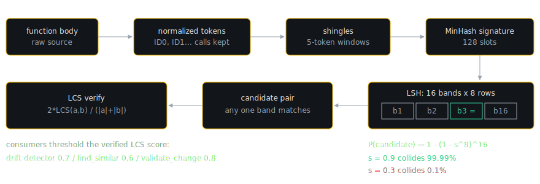

# Layer 1.7: Code DNA

Layer 1.7 is the function-level analysis layer. Where the Layer 1 analyzers and drift detectors reason about files (which convention does this file follow, how does it compare to its peers), Code DNA reasons about individual functions: it extracts every function in the repo, reduces each one to compact structural signatures, and compares those signatures to find duplicated logic, workflow-shape similarity, architectural pattern mixing, and unsanitized input flows. Everything in this layer runs locally and costs nothing.

The orchestrator is `runCodeDnaAnalysis(ctx)` in `src/codedna/index.ts`. It runs one shared extraction pass and then five modules in order:

1. Semantic fingerprinting (`semantic-fingerprint.ts`): exact duplicates by normalized-body hash.
2. Operation sequences (`operation-sequence.ts`): workflow-shape similarity over abstract opcodes.
3. Pattern classification (`pattern-classifier.ts`): Bayesian architectural-pattern posterior per file.
4. Taint analysis (`taint-analysis.ts`): two-phase source-to-sink flow tracking.
5. Deviation heuristics (`deviation-heuristics.ts`): was this pattern deviation intentional or accidental?

Findings are aggregated from modules 1, 3, 4, and 5. Module 2's similarities are computed and kept on the result, but deliberately never become findings; the reason is explained in its section below.

## Shared function extraction

`src/codedna/function-extractor.ts` extracts functions with per-language regexes, not tree-sitter. It covers Go (`func`), JS/TS (`function` declarations and `const x = (...) =>` arrows), Python (`def`, with an indentation-based body extractor), and Rust (`fn`). The arrow-function pattern includes a return-type skipper (`skipReturnType`) that balances `{}`, `<>`, and `()` so a TypeScript annotation like `(): {a: number} =>` does not break body extraction.

Each `ExtractedFunction` (`src/codedna/types.ts`) carries the name, file, relative path, line, language, params, raw body, declaration code, a `domainCategory`, body tokens, a token count, and a body hash. Functions with bodies shorter than 10 characters or fewer than 5 tokens are dropped. `domainCategory` is a keyword classifier over the name (and sometimes body) into 17 categories such as `formatting`, `validation`, `parsing`, `data_retrieval`, `authentication`, with `general` as the fallback; the operation-sequence module later uses it to avoid comparing unrelated functions.

## Module 1: semantic fingerprinting

A semantic fingerprint is `{ functionRef, normalizedHash }`, where the hash is computed over a normalized copy of the function body. Two functions with the same normalized body are exact semantic duplicates: same logic, possibly different variable names, comments, and whitespace.

### Normalization preserves literal values

`normalizeBody` in `src/codedna/semantic-fingerprint.ts` performs, in order:

1. Strip line and block comments (`//`, `#`, `/* */`).
2. Stash string and template literals under opaque `LIT{n}` placeholders so the next step cannot touch their contents.
3. Collect locally declared variable names (`var`/`let`/`const`, Go `:=`, Python top-level assignments) and rewrite each to a positional placeholder `_v0`, `_v1`, and so on (whole-word, longest name first).
4. Restore the stashed literals verbatim.
5. Collapse all whitespace.

Step 4 is the load-bearing design decision: literal values survive into the hash. An earlier version collapsed strings to a generic `STR` token, and that produced a real false positive: `isHighCorrectionMode` and `isLowCorrectionMode` have the same shape (`return mode === '...' || mode === '...';`) but compare against different constants. The constants carry the semantics. Only identifier names are interchangeable; values never are. The regression and its fix are documented in the file header and pinned by tests in `test/unit/codedna/semantic-fingerprint.test.ts`.

The hash itself is a double-pass FNV-1a (a fast, non-cryptographic hash function): one forward pass seeded `0x811c9dc5` and one backward pass seeded `0x1a47e90b`, concatenated into 16 hex characters.

### Grouping and verification

`findDuplicateGroups` buckets fingerprints by the FNV-1a hash, then re-hashes each bucket member's normalized body with SHA-256 to eliminate FNV collisions (a regression test feeds 1000 structurally unique bodies through and asserts zero groups). A group is emitted only when at least 2 functions share the SHA-256 and span at least 2 distinct files: two identical bodies inside one file are common and are not drift. Groups whose members all live in non-shippable paths are dropped (see the filter section below).

### The finding and its calibrated confidence

`fingerprintFindings` emits analyzer id `codedna-fingerprint`. Severity is graded by blast radius, the duplicate-group size `n`: `info` at 2 members, `warning` at 3 or 4, `error` at 5 or more. Message names are capped at 10 and locations at 20 so a registry-style repo with a 200-member group cannot balloon one finding to tens of kilobytes (a regression test holds a 200-member finding under 4KB). The group size rides along as `dupGroupSize` for the scoring engine.

Confidence is the constant `STRUCTURAL_DUP_CONFIDENCE = 0.95`, and the code comment documents where that number comes from: it was calibrated, not guessed. On 2026-06-24, 79 real `codedna-fingerprint` duplicate groups harvested across 7 repos were each judged by Claude (claude-sonnet-4-6, the production deep-scan judge prompt); measured precision was 98.7% (78 of 79), with a 95% Wilson confidence interval of [93.2, 99.8]. The constant is set to 0.95, slightly below the measured value, shading toward the interval floor because the sample was JS/TS-only.

### Example: what groups and what does not

Adapted from the real fixtures in `test/unit/codedna/semantic-fingerprint.test.ts`. This pair fingerprints as a duplicate group because the bodies are identical and the shared literals (`0` and `1`) match:

```ts
// src/a.ts and src/b.ts, byte-identical body
function clamp01(value: number): number {
  if (value <= 0) return 0;
  if (value >= 1) return 1;
  return value;
}
```

VibeDrift reports one `codedna-fingerprint` finding: "Exact semantic duplicate: clamp01(), clamp01() have identical normalized bodies across 2 files", severity `info` (2 members), confidence 0.95.

This pair does not group, even though the shape is identical, because the string literals differ and literals are preserved in the hash:

```ts
// src/background/audio/tempo-beat-correction.ts
return mode === 'high-overshoot' || mode === 'high-overread-nonclassic';
// src/background/audio/tempo-correction-support.ts
return mode === 'low-ambiguous' || mode === 'mid-underread';
```

No finding is emitted. Renaming every variable in `clamp01` would still group it; changing `0.05` to `0.08` in a tax helper would not.

## The MinHash pipeline: the shared near-miss engine

Exact hashing only catches identical bodies. Near-duplicates (a copied function with one edited line) need a similarity search, and comparing every function against every other is quadratic. `src/codedna/minhash.ts` implements the standard answer: MinHash plus locality-sensitive hashing (LSH), with an exact verification step at the end. The pipeline is tokenize, normalize, shingle, MinHash, LSH, then LCS verify.



The default constants, from `src/codedna/minhash.ts`:

```ts
export const DEFAULT_SHINGLE_SIZE = 5;
export const DEFAULT_PERMUTATIONS = 128;
export const DEFAULT_LSH_BANDS = 16;
export const DEFAULT_LSH_ROWS = 8;
```

Stage by stage:

- **Tokenize**: strip comments; the token regex captures identifiers, numbers, and single-character punctuation. String literals become `"STR"` and numbers become `NUM` during normalization. Unlike the exact-duplicate tier, this engine wants near-misses, so literal values are noise here rather than signal.
- **Normalize, preserving call targets**: local and parameter identifiers become positional `ID0, ID1, ...`, but any dotted chain ending in a call, like `db.query(` or `Repository.find(`, stays literal. The file header states the reason: the API a function calls is architectural signal, not noise. Two functions that do the same thing against different APIs should score lower than two that call the same API.
- **Shingle**: overlapping windows of 5 consecutive tokens. Similarity between two token streams is then Jaccard similarity over their shingle sets (the size of the intersection over the size of the union).
- **MinHash**: 128 seeded FNV-1a permutations compress each shingle set into a 128-slot signature; the fraction of matching slots between two signatures estimates their Jaccard similarity. The seeds are derived arithmetically rather than being a true random permutation family; a comment documents the measured deviation as under 1% for well-mixed inputs.
- **LSH**: each 128-slot signature is cut into 16 bands of 8 rows. Two functions become a candidate pair if any band matches exactly. The collision probability for true Jaccard similarity `s` is `P = 1 - (1 - s^8)^16`: 99.99% at s = 0.9 (the file header's table rounds this one to 99.999%), 94.7% at s = 0.8, 61.3% at s = 0.7, 6.1% at s = 0.5, and 0.1% at s = 0.3. The curve is the point: near-duplicates almost always collide, unrelated code almost never does, and the quadratic comparison collapses to just the colliding pairs.
- **LCS verify**: every candidate pair is confirmed with an exact longest-common-subsequence similarity, `2 * LCS(a, b) / (|a| + |b|)`, with a fast rejection to 0 when the shorter stream is less than half the longer one. The code comment claims LCS similarity cannot exceed 0.5 in that case; the true bound is 2/3 (`2 * min / (min + max)` approaches it from below), which still sits safely under the 0.7 flag threshold, though 0.6-threshold consumers can in principle lose a pair in the 0.6 to 0.66 range to this shortcut. This is the number consumers threshold on.

`buildSignature(source)` is the one-shot helper returning `{ tokens, shingles, signature }`; it is reused by the drift detector, the persisted baseline builder, and the MCP tools, so every consumer measures similarity in exactly the same space.

### One engine, several thresholds

Different consumers ask the engine different questions, so they gate at different points:

| Consumer | Threshold | Configuration | Why |
|---|---|---|---|
| `src/drift/semantic-duplication.ts` (batch drift detector) | LCS >= 0.7, min 15 body tokens, cross-file only | 16 bands x 8 rows | Precision-tuned discovery: flags rename-refactor duplicates, rolls up per directory |
| `src/ml-client/sampler.ts` (deep-scan sampler) | band [0.55, 0.8], inclusive at both ends | 32 bands x 4 rows | Recall-oriented: surfaces the ambiguous pairs the precision-tuned detector excludes, so the cloud judge can rule on them |
| `find_similar_function` MCP tool | LCS >= 0.6, cap 20 | exact LCS against every index entry, no LSH gate | One-vs-N discovery search over the baseline index |
| `validate_change` MCP tool | LCS >= 0.8, cap 20 | exact LCS against every index entry, no LSH gate | A change introducing a near-clone warrants a stricter bar than discovery |

The MCP one-vs-N path (`src/codedna/find-similar-to-body.ts`) skips LSH entirely: with a single query against a prebuilt index, the exact scan is cheap and covers the full similarity range including exact duplicates.

## Module 2: operation sequences

`extractOperationSequences` reduces each function body to a sequence of abstract opcodes, one of 22 values defined in `src/codedna/types.ts`:

`INPUT`, `AUTH`, `VALIDATE`, `CACHE_READ`, `CACHE_WRITE`, `QUERY`, `MUTATE`, `METRICS`, `EMIT`, `API_CALL`, `RETRY`, `LOCK`, `RESOURCE`, `LOG`, `SERIALIZE`, `DESERIALIZE`, `AGGREGATE`, `LOOP`, `BRANCH`, `TRANSFORM`, `RETURN_OK`, `RETURN_ERR`.

Each line is classified by a first-match-wins regex table whose ordering is deliberate: `RETURN_ERR` is checked before `BRANCH`, for example, so Go's `if err != nil { return err }` classifies as one error-return op instead of a branch. Consecutive duplicate ops are collapsed, so ten `TRANSFORM` lines in a row read as one.

`findSequenceSimilarities` compares pairs that are cross-file, share the same non-trivial `domainCategory` (skipping `general` and `request_handling`, which are too broad to mean anything), have at least 3 ops each, and are not both non-shippable. Similarity is `LCS(seqA, seqB) / max(|A|, |B|)`, flagged at 0.80 or higher, and then a specificity gate is applied: the shared subsequence must carry at least 2 distinctive ops (anything other than `TRANSFORM`, `BRANCH`, `LOOP`) or be at least 6 ops long. Without that gate, two short functions that both loop and branch would trivially clear 0.80 while having nothing in common.

> [!IMPORTANT]
> Operation-sequence similarities are deliberately not surfaced as findings. The aggregation comment in `src/codedna/index.ts` explains why: opcode LCS measures workflow-shape similarity, which is a consistency signal, not evidence of duplicate logic. Sibling command handlers legitimately share a load, validate, log, return shape, so reporting them as near-duplicates conflates correct consistency with redundancy; it was a systematic false-positive source (for example `runDoctor` vs `runLogout`). Genuine duplicates are caught by the body-level detectors instead. The data stays on `CodeDnaResult.sequenceSimilarities`, where the drift signal and the deep-scan preview use it.

A `sequenceFindings` emitter exists in `operation-sequence.ts` (analyzer id `codedna-opseq`) but is not wired into the aggregate findings.

## Module 3: Bayesian pattern classification

`pattern-classifier.ts` classifies handler- and service-like files (paths matching handler, controller, service, route, endpoint, api, resource) into an `ArchPattern`: `repository`, `raw_sql`, `orm`, `direct_db`, `http_client`, or `none`. Signals are regexes (SQL statement literals, `cursor.execute(`, ORM imports, injected-repository access, `fetch(`/`axios.`, and so on), each tallied for its pattern.

Counting signals alone is a likelihood-only estimate, and the file header describes the problem with it: a file in `handlers/` with 3 repository signals and 1 raw-SQL signal was 75% repository, full stop, no matter where it lived. The classifier instead combines the likelihood with a context prior via Bayes' rule:

```text
P(pattern | signals, context) ∝ P(signals | pattern) · P(pattern | context)
```

The prior comes from two sources. Directory semantics: a path under `repositor(y|ies)/`, `store/`, or `dal/` multiplies the repository pattern's prior by 2.0 and http_client's by 0.5; `migrations/` boosts raw_sql by 2.0, because raw SQL in a migration is expected, not drift. Language: Go nudges repository (1.2) and raw_sql (1.1), Python nudges orm (1.3), Rust nudges repository (1.1), JS/TS stays uniform. The effect is that the same signals land at high confidence where context reinforces them and lower confidence where it does not.

A file is `isInternallyInconsistent` when its maximum posterior is below 0.6 while more than one pattern has evidence. `patternFindings` emits `codedna-pattern`: a `warning` when a file's dominant pattern deviates from the project-wide dominant, and an `info` "Mixed patterns" finding (confidence 0.6) for internally inconsistent files.

## Module 4: two-phase taint analysis

`taint-analysis.ts` tracks user-controlled input from sources to dangerous sinks. Taint analysis means: mark values that came from outside (URL parameters, request bodies), propagate the mark through assignments, erase it at sanitizers, and report when a marked value reaches a sink that must never receive raw input.

**Phase 1 is intraprocedural**: within each function, variables assigned from a taint source are tracked through the body; a flow is emitted when one reaches a sink.

**Phase 2 is one-hop interprocedural**: each function gets a summary, `paramsTainted`, the set of parameter indices that would reach a sink inside it. Then every call site `g(arg1, arg2, ...)` is checked: if the caller's `arg_i` is tainted and `i` is in `g`'s summary, a one-hop flow is emitted. The header states why it stops at one hop: the dominant real-world pattern is a handler passing unsanitized input to a service, and a full fixpoint iteration is expensive while rarely catching what one hop misses. Calls are resolved by bare function name only (no module scoping), which the header lists as a limitation.

Sources, sinks, and sanitizers are per-language regex tables:

| Table | Examples |
|---|---|
| Sources | Go `c.Param(`, `mux.Vars(`; JS/TS `req.params.*`, `req.body.*`, Hono `c.req.param(`; Python `request.args.get(`; Rust `web::Path` |
| Sinks (categorized) | `sql_injection`, `command_injection`, `path_traversal`, `xss`, `code_injection`, `ssrf`; each sink carries its own `error` or `warning` severity |
| Sanitizers | zod/joi `schema.parse` (clears all categories); `parseInt` / `strconv.Atoi` (clears sql_injection); `$N` / `?` query parameterization; DOMPurify (xss); `path.join` / `path.resolve` (path_traversal) |

`taintFindings` emits `codedna-taint` findings at confidence 0.75, deduplicated by file, function, and sink type, with severity taken from the sink definition. The exported `INJECTION_SINK_LABELS` (the code- and command-injection sink labels) feed the render-only security-floor badge described in the Output Surfaces chapter.

## Module 5: deviation heuristics

When the pattern classifier finds a file deviating from the project's dominant architecture, the interesting question is not "does it deviate" but "was that on purpose". `deviation-heuristics.ts` scores each deviating file from 0 to 1 as `0.5 + sum of signal weights`, clamped. The default weights live in `DEFAULT_DEVIATION_WEIGHTS` in `src/core/config.ts`:

| Signal | Weight | Reading |
|---|---|---|
| `complex_sql` | +0.15 per indicator, capped at 2x | Complex SQL suggests a deliberate performance escape hatch |
| `explanatory_comment` | +0.20 (absence costs 0.1) | Someone wrote down why |
| `special_directory` | +0.20 | Migrations, scripts, and similar homes expect deviation |
| `simple_crud_penalty` | -0.30 | Trivial CRUD in raw SQL has no justification story |
| `same_directory_penalty` | -0.20 | Deviating right next to conforming peers looks accidental |
| `git_recency` | +0.15 | Recently touched code is more likely a live decision |
| `adjacent_test` | +0.15 | Tested deviations look intentional |
| `adr_mention` | +0.25 | Referenced in an architecture decision record |

Weights are overridable per project via `.vibedrift.json` under `deviation_heuristics.signal_weights`. Verdicts: `likely_justified` at 0.6 and above, `likely_accidental` at 0.3 and below, `uncertain` between. Only `likely_accidental` becomes a finding (`codedna-deviation`, severity `warning`, confidence `max(0.5, 1 - justificationScore)`); justified and uncertain deviations are recorded on the result but stay silent, because flagging an intentional, documented deviation trains users to ignore the tool.

## The non-shippable filter

`src/codedna/nonshippable.ts` classifies paths as non-shippable: generated code (`generated/`, `.pb.go`, `_pb2.py`, `.min.*`), fixtures, mocks, snapshots, tests (`__tests__/`, `.test.*`, `_test.go`, `test_*.py`), and examples/demos/samples.

The consumption rule matters more than the list: `allNonShippable` drops a duplicate group only when every member is non-shippable. Two identical `mkCtx()` helpers in two test files are not a consolidatable duplicate, but a `src/` helper copied into a test still surfaces, because that group has a shippable member. The header documents that this mirrors the paid API's pre-filter (`api/models/dup_prefilter.py` in the API repo), so the free CLI and the cloud path agree on what counts.

> [!NOTE]
> Code DNA primitives outlive the scan. The persisted per-repo baseline that powers the MCP server (`src/core/baseline.ts`) builds its `minhashIndex` from `extractAllFunctions` plus `buildSignature`, which is why the in-loop duplicate checks in the MCP chapter measure similarity in exactly the space described here.
