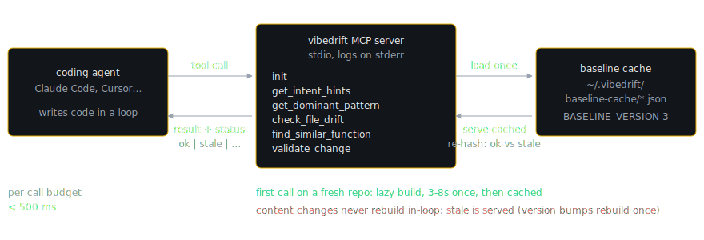

# The MCP Server: Drift Checks in the Agent Loop

A batch scan reports drift after the code exists. By the time `vibedrift scan` flags a `.then()` chain in a repo that settled on async/await, the agent that wrote it has moved on, the diff is merged, and fixing the drift is a separate chore someone has to schedule. The MCP server moves the same checks to the moment that matters: while the agent is deciding what to write. An agent that asks "what is this repo's dominant error-handling pattern" before writing a handler, or "does this function already exist" before implementing it, does not introduce the drift in the first place. That is the product thesis, stated in the server's own instructions (`src/mcp/server.ts`): the local in-loop tools are free for everyone and answer conformance questions during coding; batch `--deep --diff` runs remain the recommendation for reviewing a finished change-set.

MCP (Model Context Protocol) is the standard by which coding agents like Claude Code call external tools. VibeDrift's server speaks it over stdio: `vibedrift mcp` (or `node dist/mcp/server.js`) starts a server named `vibedrift` that registers six tools. All logging goes to stderr, because stdout is the JSON-RPC channel; a stray `console.log` would corrupt the protocol stream.

## Two layers: tools-core and the MCP adapter

The tools are implemented twice-decoupled:

- `src/tools-core/` is the channel-neutral core. Each tool is a plain async function (`getIntentHints`, `getDominantPattern`, `checkFileDrift`, `findSimilarFunction`, `validateChange`) exported from `src/tools-core/index.ts`, callable from code-mode hosts, Agent Skills, or git hooks without any MCP machinery. Nothing in `tools-core` imports the MCP SDK, and that is not a convention but a tested invariant: `test/unit/tools-core/no-mcp-coupling.test.ts` fails the build if the coupling appears.
- `src/mcp/` is the stdio adapter. Each file in `src/mcp/tools/` registers the corresponding core `run` function on the `McpServer` and wraps the plain result in the wire envelope.

The envelope (`src/mcp/envelope.ts`) is one shape for every tool: the structured result is serialized into a single `text` content block and mirrored as `structuredContent`, so machine-parsing agents and text-only clients both get the data.

## The never-throw status contract

Tools never throw to signal "no data". Every result carries a `status` from `src/tools-core/result.ts`:

```ts
export type Status = "ok" | "partial" | "stale" | "no_baseline" | "degraded";
```

| Status | Meaning |
|---|---|
| `ok` | Answered from a baseline that matches the working tree |
| `partial` | Local answer plus an opt-in cloud deep check both contributed |
| `stale` | Answered from a cached baseline that no longer matches the working tree |
| `no_baseline` | No baseline could be built (empty dir or failed build); the result is an honest empty shape |
| `degraded` | An opt-in deep check could not reach the cloud (not signed in, over budget, rate limited, network); the local result is still returned |

A `no_baseline` response carries `NO_BASELINE_MESSAGE`, which tells the agent how to fix it ("Run `vibedrift scan` once to build it") and to proceed without conformance data. The design goal is that an agent can always keep working: a tool error would derail the agent's turn, while a status lets it degrade gracefully.

Write-time tool results may additionally carry a `NudgeHint`: a gated, cooled-down FYI offering a deep scan (fires only when the user is signed in, after 8 or more write-time calls in a session, at most once per day, and only when the user has never deep-scanned or their last deep scan is older than 3 days; the timestamp lives in the global `~/.vibedrift/config.json`, so it is per-user, not per-repo, and a deep scan of any repo resets it; `src/tools-core/nudge.ts`).

## The six tools

| Tool | Question it answers | Key inputs and outputs |
|---|---|---|
| `init` | Set this repo up (config, ignore rules) | In: `rootDir`, optional `exclude` globs, `applyDetectedExcludes`, `detectOnly`. Out: config written to `<repo>/.vibedrift/config.json`, optional `.vibedriftignore`. Detection and application are separate: candidates are auto-detected but only written when explicitly requested; the tool never silently excludes files |
| `get_intent_hints` | What conventions has the team declared? | In: `rootDir`. Out: hints parsed from CLAUDE.md, AGENTS.md, .cursorrules as `{dimension, pattern, label, source, line, text, binding: true}`. All hints are marked binding; declarations are the team's ground truth and override inferred patterns, so the parser's confidence tiers are deliberately dropped from this surface |
| `get_dominant_pattern` | What does this repo actually do for dimension X? | In: `rootDir`, `dimension` (one of `error_handling`, `imports`, `exports`, `async`, `naming`, `data_access`, `logging`, `auth`). Out: `{dominantPattern, consistency, examples}` projected from the baseline vote; `auth` reads the granular `securitySubVotes["Auth middleware"]` instead of the collapsed security vote |
| `check_file_drift` | Does this existing file fit the repo? | In: `rootDir`, `filePath`. Out: `{fits, deviations[], more}` capped at 3 deviations, each with `{dimension, yourPattern, dominantPattern, consistency, fixHint}` citing an exemplar file |
| `find_similar_function` | Does something like this already exist? | In: `rootDir`, `body`, optional `deep`. Out: `{found, matches[{relativePath, name, line, similarity}], more}`; local LCS threshold 0.6, cap 20 |
| `validate_change` | Would this proposed function drift or duplicate? | In: `rootDir`, `targetPath`, `body`, optional `deep`. Out: `{ok, conflicts[], duplicateOf[], referenceFiles[], confidence}`; the only tool that judges uncommitted code |

Dimension names in `get_dominant_pattern` map onto real drift categories (`error_handling` to `return_shape_consistency`, `data_access` to `architectural_consistency`, `auth` to `security_posture`, and so on). When no vote fired for a dimension, the tool reports it as consistent, with a consistency string of 100% annotated "no deviations detected"; when a vote exists but sits below the reliable-sample floor, the consistency string carries an explicit "treat as advisory" hedge.

## Baseline cache mechanics

Every tool except `init` and `get_intent_hints` answers from the persisted `RepoDriftBaseline` (`src/core/baseline.ts`): the per-repo cache of category votes, security sub-votes, intent hints, and the MinHash function index. A full scan takes 3 to 8 seconds; the baseline lets each tool call overlay one file or one function against the cached aggregate in well under the server's target budget of 500ms per call.



On disk it lives at `~/.vibedrift/baseline-cache/<sha256(rootDir)[:16]>.json`, never inside the project. `BASELINE_VERSION` is currently 3 and is bumped whenever vote logic, the detector set, or the signature format changes. The cache key is a content merkle: SHA-256 over `BASELINE_VERSION\n` plus the sorted `path:hash` lines of every scanned file, so a version bump invalidates every cache at once.

`getBaseline(rootDir)` in `src/mcp/baseline-provider.ts` implements the serving policy:

1. Serve from the in-process memory cache, else load from disk without checking freshness.
2. **Never scanned: lazy build.** The first tool call on a fresh repo builds the baseline (a one-time 3 to 8 seconds), persists it, and returns `ok`, so the MCP server works out of the box with no manual scan step. Concurrent first calls share one build via an in-flight promise map. Only a genuinely empty directory or a failed build yields `no_baseline`.
3. **Version mismatch: rebuild once.** A baseline built under an older `BASELINE_VERSION` is missing current vote shapes (for example `securitySubVotes`), so it triggers a rebuild. A failed rebuild is remembered in a `failedVersionRebuild` set and not retried on every call; the old baseline keeps being served rather than hard-failing the session.
4. **Content staleness: re-hash, do not rebuild.** The provider re-hashes the working tree's known files into the same merkle key. On mismatch it returns `status: "stale"` and still serves the cached baseline, because a synchronous rebuild would blow the latency budget.

> [!WARNING]
> The staleness check re-hashes only the files the baseline already knows about (a missing file hashes as `"MISSING"`). Files created after the last scan are invisible to it, so a brand-new file does not flip the status to `stale`. This is a documented v1 limitation in `src/mcp/baseline-provider.ts`.

The trade-off is explicit: an agent gets a slightly stale answer in milliseconds instead of a fresh answer in seconds, and the `stale` status tells it which one it got. One more coupling matters: when the `init` tool writes new exclusions, it deletes the persisted baseline and calls `invalidateBaselineMem(rootDir)`, because the freshness check cannot notice that the file set itself changed.

## validate_change in depth

`src/tools-core/tools/validate-change.ts` is the pre-commit judge: the agent hands it a proposed function body plus the file it will land in, and gets back whether the change would drift from the repo or duplicate existing code, before the code is written to disk.

### Dimension conflict checks

Three dimensions are checked, defined in the `DIM_CHECKS` table: `async_patterns`, `return_shape_consistency`, and `architectural_consistency`. Each pairs a single-body classifier with the dimension's canonical label set, and each classifier is the same one the corresponding batch detector uses (`classifyAsyncStyle`, `classifyReturnShapeLabel`, `classifyDataAccessLabel`). The comment states the invariant this buys: the in-loop check can never disagree with the detector, because they are literally the same classification code.

The dominant pattern to compare against is resolved by `effectiveDominant`: the detector vote when its stored label is in this dimension's vocabulary, otherwise the team's highest-confidence declared intent hint. The declared fallback is what catches the first deviation in a fully consistent dimension: a repo with zero async findings has no vote, but a declared "use async/await" rule is still binding. (For `architectural_consistency`, which is a composite category, the vote is honored only when it is actually a data-access label; a dependency-injection vote stored under the same category does not silence a declared ORM rule.)

A conflict is emitted when the body classifies to a different label than the dominant, with a `fixHint` of the form `Repo uses <dominant>; this change uses <yours>.` plus either an exemplar file or the declaring line (for example `(declared in CLAUDE.md:14)`).

### Duplicate check

The proposed body runs through `findSimilarToBody` against the baseline's MinHash index at `DUPLICATE_THRESHOLD = 0.8`, stricter than the 0.6 the discovery tool uses, because introducing a near-clone is a stronger claim than "something vaguely similar exists". The target file's own entries are excluded from the index first, so editing an existing function never flags it as a duplicate of itself.

### The hedged auth check

`checkRouteAuthDrift` fires only when all of the following hold: the proposed body registers a mutating route with no visible per-route guard (classified by `classifyRouteAuth`, which reuses the batch AST route extractor), and the repo's own convention says auth is expected, either through the peer-majority `"Auth middleware applied"` sub-vote or a declared `auth_required` intent hint. Otherwise it returns null, honest silence, including the healthy case where there is nothing to compare against.

When it fires, the fixHint cites a truthful count ("Repo applies auth on 14 of 16 mutating routes") or the declaring line, offers the `// @vibedrift-public` annotation for intentionally public routes, and always appends the caveat: "router-level middleware is not visible to this in-loop check, so this is a hint, not a verdict." The caller forces `confidence: "low"` whenever this conflict is present, and keeps it low even when a later deep pass returns confident cloud findings, because a single-body check structurally cannot see router-scope middleware and must never pretend it can. A below-floor auth vote (too few routes to be reliable) is additionally hedged as advisory inside the hint.

### The confidence hedge

Output confidence is `"low"` whenever the judged dimension's own `consistencyScore` is under `THIN_MARGIN = 75`, just above the 70% dominance bar the detectors use. The reasoning is in the comment: the baseline is frozen, so a vote that barely cleared dominance could plausibly be tipped by the very change being validated, and the tool should not claim high confidence about a majority that thin. A declared-rule fallback has no vote and stays high; a declaration is binding regardless of current code.

### Opt-in deep mode

Passing `deep: true` adds a metered cloud pass (described here at the interface level; entitlement and billing are enforced server-side, and the tool schema documents the cost as 1/50 of a deep scan, hourly-capped). The fast path (`src/mcp/deep-index.ts`) embeds only the proposed function via `/v1/embed` and compares it by cosine similarity against the local per-repo embedding index, with a two-tier verdict: cosine at or above 0.9 ships directly as a confirmed semantic duplicate with no further cloud call; matches in the borderline band [0.72, 0.9) are sent, at most 8 of them with their stored bodies, to the cloud for an LLM confirm-or-reject, keeping only responses at or above 0.9; below 0.72 is dropped. If no embedding index can be built yet, the cold-start fallback (`src/mcp/candidate-feeder.ts`) re-extracts the repo's functions, samples up to 29 candidates with the batch deep-scan sampler, and sends query plus candidates to `/v1/analyze`, because sending the query alone would leave the pairwise detector repo-blind.

Deep hits set `ok: false` and `status: "partial"`. Any cloud failure resolves to `status: "degraded"` with a human-readable reason (`deepAnalyze` in `src/mcp/deep-client.ts` never throws; it maps HTTP 402 to `quota`, 429 to `rate_limited`, and so on), and the local result stands.

## A worked session

Suppose a repo whose baseline votes `async_patterns` at `dominantPattern: "async/await"`, consistency 91%, and the agent is about to add a lookup helper to `src/services/order-service.ts` written with promise chains:

```ts
function loadOrder(id: string) {
  return db.orders.findOne(id).then((order) => {
    return enrich(order);
  });
}
```

The agent calls `validate_change` with `rootDir`, `targetPath: "src/services/order-service.ts"`, and that body. `classifyAsyncStyle` returns `then_chains`, whose display label `.then() chains` differs from the dominant `async/await`, so the response is:

```json
{
  "status": "ok",
  "ok": false,
  "conflicts": [{
    "dimension": "async_patterns",
    "dominantPattern": "async/await",
    "yourPattern": ".then() chains",
    "fixHint": "Repo uses async/await; this change uses .then() chains. See src/services/user-service.ts."
  }],
  "duplicateOf": [],
  "referenceFiles": ["src/services/user-service.ts", "src/services/cart-service.ts"],
  "confidence": "high"
}
```

Confidence is `high` because 91 clears the 75 thin-margin bar. The agent rewrites the helper with `async`/`await`, calls `validate_change` again, gets `ok: true`, and writes the file. The drift never existed, which is the entire point of the in-loop design: the batch scanner would have caught the same conflict with the same classifier, but only after it was committed.
